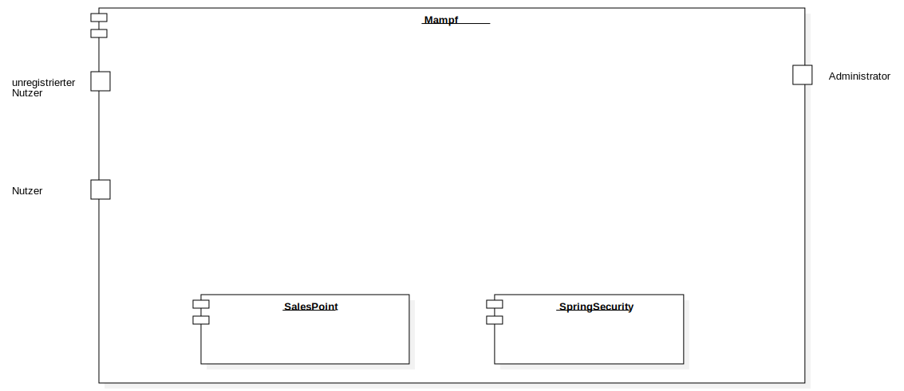
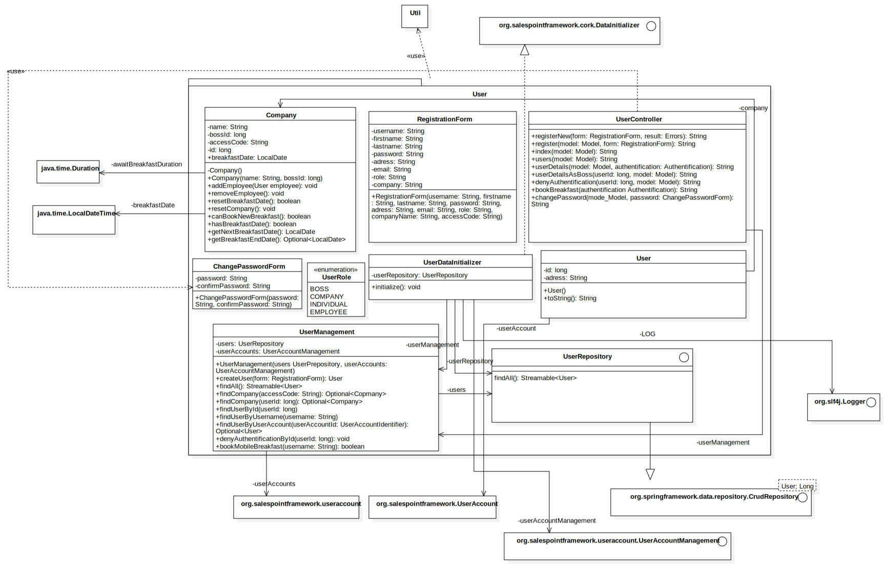
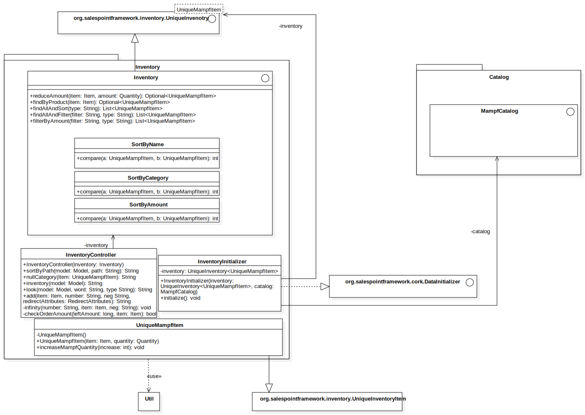

:project_name: Mampf
:doctype: book
:icons: font
:source-highlighter: highlightjs
:numbered:
:toc:
:toc-title: Inhaltsverzeichnis

[options="header"]
[cols="1, 3, 3"]
|===
|Version | Bearbeitungsdatum   | Autor 
|1	|  29.11.2020| Florian Mehnert, yajo10, pati6, k12345678910, thejezzi
|===

= Entwicklerdokumentation

toc::[]

== Einführung und Ziele

=== Aufgabenstellung
"Cateringservice
Essen und Trinken hält Leib und Seele zusammen“ besagt ein altes deutsches Sprichwort.
Das dachte sich auch Hannes Wurst und baute seinen kleinen Imbissstand zu dem inzwischen
renommierten Cateringservice Mampf mit vielen Angestellten und guter Auftragslage aus.
Jetzt möchte er endlich auch eine Software haben, mit der er alle Abrechnungs-, Bestell- und
Verwaltungsaufgaben einheitlich bearbeiten kann. Bisher nutze Herr Wurst dafür diverse
Programme und ärgerte sich immer wieder über deren Inkompatibilität zueinander und den
Mehraufwand durch getrennte Datenhaltung. Als Basis für die Softwareentwicklung gab er
uns folgende Beschreibung seines kleinen Unternehmens:
Mampf gliedert sich in vier Geschäftsfelder. Das Eventcatering übernimmt die Verpflegung
bei großen Veranstaltungen, egal ob in Form eines Buffets oder als Galadinner. Auf Wunsch
gestaltet Mampf auch das komplette Event, d.h. neben den Speisen und Getränken wird auch
Dekoration, Ausrüstung (also Geschirr, Tischtücher usw.) und Personal zur Verfügung
gestellt, wobei der Kunde dann natürlich zusätzlich zum eigentlichen Preis für Lebensmittel
und Arbeitszeit auch Leihgebühren und Personalkosten bezahlen muss. Der Partyservice
beliefert private Feierlichkeiten mit kalten Platten – von Hochzeiten und Beerdigungen über
Gartenfeste bis zu Omas 75sten Geburtstag. Hierbei gibt es Festpreise je nach Angebot und
Personenanzahl (z.B. Schinkenplatte für 5 Personen zu 20,- EUR, Käseplatte für 3 Personen
zu 12,50 EUR usw.) und Sonderaktionen (z.B. Sushi-Abend für 10 Personen). Eine
Besonderheit von Mampf ist Mobile Breakfast – ein mobiler Frühstücksservice für kleinere
Firmen ohne eigene Kantine. Zu festgelegten Zeiten können die Mitarbeiter sozusagen am
Arbeitsplatz eine Auswahl an Frühstücksangeboten (belegte Brötchen, Müsli, Kaffee und Tee
usw.) kaufen. Die Firmen buchen das Angebot monateweise. Problematisch ist allerdings die
Planung dieses Angebotes – hier wird derzeit noch nach einer kostensparenden Lösung (z.B.
in Form einer Vorbestellung) gesucht. Immer beliebter wird bei den Kunden auch das vierte
Angebot von Mampf: Rent-a-Cook. Dabei wird Küchen- und Servicepersonal an
Privathaushalte verliehen, um z.B. den Chef des Gastgebers mit kulinarischen Köstlichkeiten
zu beeindrucken. Um die Lebensmittel müssen sich die Kunden dabei selbst kümmern.
Hannes Wurst hat nun ganz genaue Vorstellungen von der zu entwickelnden Software: Sie
soll die Kundenverwaltung unterstützen, die Personalverwaltung und -zuteilung übernehmen,
die Termine planen, das Zubehör (Dekoration, Ausrüstung) verwalten, den
Lebensmittelbedarf bestimmen (Anzahl Gerichte/Platten/belegte Brötchen, Menge an
Getränken in Liter), die Rechnungsstellung an die Kunden vereinfachen und sämtliche
Abrechnungen erleichtern. Die Lebensmittelbeschaffung muss nicht betrachtet werden, durch
die langjährigen Erfahrungen bei Mampf ist der Einkaufspreis pro Gericht/Platte/Getränk
jedoch bekannt."

Diese Software soll dem Betreiber und seinen potentiellen Kunden eine einfachere und schnellere Möglichkeit der
Kommunikation und Interaktion bieten. Potentielle Kunden sollen ein festes Konto besitzen, sich also registrieren können
und dadurch eine schnellere Übersicht über das gesamte Angebot bekommen und dadurch auch schneller und einfacher
bestellen können. Gleichwohl soll der Inhaber eine bessere und automatisierte Übersicht über alle Bestellungen bekommen,
welche dadurch auch einfacher zu administrieren sind. Außerdem hat der Inhaber durch diese Software die Möglichkeit
seine Kunden schneller und kostengünstiger von neuen Angeboten und neuen Produkten zu informieren. Da es nur um einen
Cateringservice geht, wird auf sicherste Authentifizierungsmechanismen verzichtet und lediglich ein Passwort benötigt.
Zusätzlich soll jeder Besucher des Services die Möglichkeit besitzen, sich auch ohne Registrierung einen Überblick über
die Angebote zu machen.

Die Software soll ansprechend und einladend aussehen und möglichst einfach aufgebaut sein damit sich jeder Benutzer zurechtfindet, was gleichermaßen bedeutet, dass sich an bestehende Designs angepasst wird.

=== Qualitätsziele

Wartbarkeit::
Dieses Merkmal stellt den Grad der Wirksamkeit und Effizienz dar, mit dem ein Produkt oder System modifiziert werden kann, um es zu verbessern, zu korrigieren oder an Veränderungen in der Umgebung und an die Anforderungen anzupassen.

Benutzerfreundlichkeit::
Bedeutet, dass bestimmte Benutzer eines Produktes oder Systems, ihre Aufgaben mit Effektivität, Effizienz und Zufriedenheit, in einem bestimmten Kontext, umsetzten können.

Sicherheit::
Stellt sicher, dass System-relevante Informationen und Daten geschützt werden und Personen und Systeme nur darauf Zugriff besitzen, welche ihren Berechtigungsstufen entsprechen.

1 = Nicht wichtig ..
5 = Sehr wichtig
[options="header", cols="3h, ^1, ^1, ^1, ^1, ^1"]
|===
|Qualitätsziel            | 1 | 2 | 3 | 4 | 5
|Wartbarkeit              |   |   |   | x |
|Benutzerfreundlichkeit   |   |   | x |   |
|Sicherheit               |   |   |   | x |
|===

== Randbedingungen
=== Hardware-Vorgaben
Benötigte Geräte zum Anwenden und Ausführen der Software

- Server
- Computer
- Tastatur
- Maus

=== Software-Vorgaben

Folgende Java-Version muss mindestens verfügbar sein um die Software auf dem Server ausführen zu können

- Java 11.x

Folgende Browser und die entsprechende Version sind nötig um das Frontend der Software einwandfrei ausführen zu können

- Internet Explorer / Edge 10.0

- Firefox 4.0

- Google Chrome 4.0

- Opera 9.6

=== Vorgaben zum Betrieb des Software

Dieses System wird vom Kunden Hannes Wurst als WebShop selbst auf einem Server seiner Wahl betrieben und dient zur Verteilung seiner Dienstleistungen an seinen derzeitigen Kundenbestand und gleichzeitig dazu seinen Kundenkreis zu erweitern.
Über das Internet soll die Software jederzeit für jeden zur Verfügung stehen. Hannes Wurst soll die Verwaltung seiner Dienstleistung und seiner Mitarbeiter bzw. Kunden erleichtert werden.

Hauptzielgruppe dieser Software sind Privatpersonen als auch Firmen und ihre Mitarbeiter, die mit der grundlegenden Bedienung einer Website vertraut sind.
Außerdem Administratoren, die zur Benutzung keine informationstechnischen Kenntnisse benötigen müssen.

Das Wartungspotential der Software muss nahezu nicht vorhanden sein, da die Administratoren keine Kompetenz in jeglicher Fachrichtung, die zur Wartung benötigt werden würde, besitzen und auch kein Servicevertrag vereinbart wird. Außerdem müssen alle Daten persistent in einer Datenbank abgelegt werden und für die Administratoren einfach zugänglich sein.

== Kontextabgrenzung

[[context_diagram]]

== Lösungsstrategie
=== Erfüllung der Qualitätsziele
[options="header"]
[cols="1,5"]
|=== 
|Qualitätsziel |Lösungsansatz
|Bedienbarkeit
a| * *geringe Einstiegshürde* Es muss sichergestellt werden, dass das Programm
ohne großen Einarbeitungsaufwand sehr schnell benutzt werden kann.
Dazu können eindeutige Beschreibung der Eingabefelder oder sogenannte Tooltips helfen.

* *Fehlerbehandlung / Fehlervermeidung* Benutzer sollen vor Fehlern geschützt werden.
Falsche Eingabe sollen abgefangen werden und keine fatalen Folgen haben.

* *angenehme Bedienoberfläche* Dem Benutzer soll eine intuitive, angenehme Bedienung ermöglicht werden.

* *Barrierefreiheit* Möglichst vielen unterschiedlichen Benutzern mit möglichst
vielen unterschiedlichen Voraussetzungen soll die Benutzung des Systems ermöglicht werden.
Dies kann z.B. durch die Benutzung von ausreichend großen Schriftgrößen, großem Farbkontrast und alternativer Beschriftung von Bilder erfolgen.

| Sicherheit
a| * *Vertraulichkeit* Bestimmte Daten können nur von Personen eingesehen werden, die dazu autorisiert sind.
Das kann z.B. mittels _Spring Security_ und _Thymeleaf_ (`sec:authorize` - tag) umgesetzt werden.

* *Integrität* Daten sollen vor unautorisierter Veränderung geschützt sein. Dies kann mittels _Spring Security_ (`@PreAuthorize`) realisiert werden.

* *Nachverfolgbarkeit* Bestimmte Aktionen müssen eindeutig einem Akteuer zugeordnet werden können. Dazu gehört beispielsweise das Bestellen (`Order`) von Angeboten (`Offer`).

|===

=== Softwarearchitektur

[[top_level_diagram]]
image:images/diagrams/top_level_arch.svg[top level architecture]

[[client_server_diagram]]

=== Entwurfsentscheidungen
==== Verwendete Muster

* Spring MVC

==== Persistenz
Das Programm benutzt _Hibernate annotation based mapping_, um Java-Klassen automatisch in einer Datenbank zu speichern. Als Datenbank wird _H2_ benutzt.
Die persistente Speicherung kann an- und abgeschaltet werden. Das ist z.B. hilfreich, um die Datenbank mit den Standardwerten wieder herzustellen.
In der Datei _application.properties_ müssen dazu die folgenden Zeilen auskommentiert werden:

 # spring.datasource.url=jdbc:h2:./db/mampf
 # spring.jpa.hibernate.ddl-auto=update

==== Benutzeroberfläche

[[ui_diagram]]

==== Verwendung externer Frameworks

[options="header", cols="1,2"]
|===
|Externes Package |Verwendet von (Klasse der eigenen Anwendung)
|salespointframework.catalog
a| * catalog.Item
* catalog.Catalog
* order.MampfOrderManager
* order.EventOrder
* order.MampfOrder
* order.MBOrder

| salespointframework.core
a| * catalog.CatalogInitializer
* user.UserInitializer
* mampf.employee.EmployeeInitializer
* inventory.InventoryInitializer

|salespointframework.inventory
a| * catalog.CatalogController
* inventory.InventoryController
* inventory.InventoryInitializer
* order.MampfOrderManager

| salespointframework.order
a| * order.OrderController
* order.MampfOrderManager
* order.MampfOrder
* order.MampfCart
* order.EventOrder
* catalog.Item
* mampf.employee.EmployeeManager

| salespointframework.payment
a| * order.MampfOrderManager
* order.EventOrder
* order.MampfOrder
* order.MBOrder
* order.MampfOrderManager

| salespointframework.quantity
a| * catalog.CatalogController
* inventory.InventoryInitializer
* order.OrderController
* order.EventOrder
* order.MampfOrderManager
* order.MampfCart
* order.MampfOrder
* order.MBOrder

| salespointframework.SalespointSecurityConfiguration
a| * mampf.WebSecurityConfiguration

| salespointframework.time
a| * catalog.CatalogController

| salespointframework.useraccount
a| * user.User
* user.UserDataInitializer
* user.UserManagement
* order.OrderController
* order.EventOrder
* order.MampfOrderManager
* order.MampfOrder
* order.MBOrder

//------------
| springframework.boot
a| * mampf.Mampf

| springframework.data
a| * catalog.Catalog
* user.UserManagement
* user.UserRepository
* order.MampfOrderManager

| springframework.stereotype
a| * order.MampfOrderManager
* order.OrderController

| springframework.security
a| * mampf.WebSecurityConfiguration
* order.OrderController

| springframework.ui
a| * catalog.CatalogController
* user.UserController
* inventory.InventoryController
* order.OrderController
* mampf.employee.EmployeeController

| springframework.util
a| * user.UserController
* user.UserInitializer
* order.OrderController

| springframework.validation
a| * user.UserController
* order.OrderController

| springframework.web
a| * mampf.MampfWebConfiguration
* order.OrderController

|===

== Bausteinsicht
In der Bausteinsicht werden die Entwurfsklassendiagramme der einzelnen Packages aufgezeigt.

=== Mampf

[[pkg_mampf_building_block_diagram]]
image:images/diagrams/developer_doc_5_1_Mampf.svg[pkg mampf_building block diagram]

[options="header"]
|=== 
|Klasse/Enumeration |Description
| Mampf | Hauptklasse zum initialisieren des Spring-Containers und starten den Anwendung
| MampfWebConfiguration | Konfigurationsklasse zur Weiterleitung an die Route `/login` und das Template `login.html`
| WebSecurityConfiguration | Konfigurationsklasse zum bereitstellen von grundsätzlichen Sicherheitsfunktionen, wie das ein- und ausloggen
|===

=== Catalog

[[pkg_catalog_building_block_diagram]]

[options="header"]
|=== 
|Klasse/Enumeration |Description
| CatalogController | Ein Spring MVC Controller und eine bestimmte Anzahl an `Item` anzuzeigen abhängig von der jeweiligen Domäne
| Category | Enumeration, die die jeweilige Kategorie eines Produktes oder einer Dienstleistung `Item` die in einer Domäne angeboten wird, beschreibt
| Domain | Enumeration, die die jeweilige Domäne eines (bspw. PartyService) der zu vertreibenden Produkte und Dienstleistungen `Item` beschreibt
| Item | Beschreibt alle Produkte und Dienstleistungen die Mampf vertreibt
| MampfCatalog | Eine Erweiterung des Salepoint Catalog, um Mampf spezifische Funktionalitäten hinzuzufügen 
|===

=== User
[[pkg_user_building_block_diagram]]

[options="header"]
|===
|Klasse/Enumeration |Description
| User | Diese Klasse wird benötigt, um den Salespoint-UserAccount um eine Verknüpfung zu Company zu erstellen.
| UserController | Diese Klasse ist ein Spring-Controller, der alle Requests zum Registrieren und zum Anzeigen, bearbeiten, löschen von Users behandelt
| UserDataInitializer | Eine Implementierung der Initialisierung, um erste Test-Daten beim Start der Anwendung zu generieren.
| UserManagement | Eine Service-Klasse, die das Verwalten der Nutzer vereinfacht
| UserRepository | Ein Repository-Interface, um alle Instanzen der User-Klasse zu verwalten.
| Registration-Form | Ein Interface, um die Nutzereingaben bei der Registrierung zu validieren.
| UserRole | Eine Enumeration aller verwendeten Benutzer-Rollen.

|===

=== Inventory
[[pkg_inventory_building_block_diagram]]

[options="header"]
|===
|Klasse/Enumeration |Description
| Inventory | Eine Erweiterung des UniqueInventory, um die einzelnen Mampf-Items von `Item` zu managen.
| InventoryController | Diese Klasse ist ein Spring-Controller, der die Requests zum Erhöhen der Quantitäten im
Inventory, sowie die Requests zum Anzeigen der inventory Seite bearbeitet.
| InventoryInitializer | Eine Implementierung des DataInitializers, welche das Inventar mithilfe des Catalogs
und mehreren Regeln bezüglich der Quantitäten der einzelnen Gegenstände initialisiert.

|===

=== Order

[[pkg_order_building_block_diagram]]

[options="header"]
|===
|Klasse/Enumeration |Description
| OrderController | Ein Spring MVC Controller. Ermöglicht das managen eines Warenkorbs (`MampfCart`) und managet den Kaufprozess eines Warenkorbs. Außerdem managet dieser das Anzeigen von Bestellungen.
| MampfOrderManager | Eine Komponente zum managen (z.b. erstellen und validieren)von Bestellungen `MampfOrder` .
| MampfOrder | Eine Erweiterung von der Salespoint `Order` , welche eine Basisklasse für Bestellungen  von Mampf repräsentiert. Mampf-Bestellungen besitzen außerdem eine start und end Zeit.
| MBOrder | Eine `MampfOrder` Erweiterung welche eine Bestellung für ein Mobile Breakfast repräsentiert. Eine Mobile Breakfast Bestellung hat mehrere einzelne Frühstückstermine welche sich aus den gegeben Informationen über `getItems` berechenen lassen.
| EventOrder | Eine `MampfOrder` Erweiterung welche eine Bestellung für die Eventcategorien PartyService, Eventcatering und Rent-a-Cook repräsentiert. `EventOrder` können `Employee` zugewiesen werden. Der Preis einer solchen Bestellung ist dabei abhängige von der gegebenen start und end Zeit der Bestellung.
| MampfCart | Eine Sessionkomponente des `OrderController` um warenkorbitems zu verwalten. 
verwaltet `DomainCart` s.
|DomainCart| Eine Erweiterung von Salepoint `Cart` . `CartItem` s können einen fixen, aber auch einen stundenpreis besitzen, deswegen besitzt jede `DomainCart` eine start und end Zeit, um den Preis abhängig von einer eventuell gegebenen Zeitspanne berechnen zu können.
| BreakfastMappedItems | stellt eine Mobile Breakfast - Itemauswahl im Warenkorb `MampfCart` dar.
| CheckoutForm | Spring Komponente, Formular für auswahl Zahlmethode,Datum,Uhrzeit.
| MobileBreakfastForm | Spring Komponente, Formular für auswahl des Mobile Breakfast Angebotes im Katalog.
|===

=== Employee
[[pkg_employee_diagram]]

[options="header"]
|===
|Klasse/Enumeration |Description
| Employee | Eine benutzerdefinierte Klasse, die ein Mitarbeiter/Employee spezifiziert.
| EmployeeController | Eine Spring MVC Controller, um Mitarbeiter/Employees anzuzeigen oder hinzufügen.
| EmployeeDataInitializer | Eine Implementierung des DataInitializers zum Erstellen von Mitarbeiter/Employees beim Starten der Anwendung.
| EmployeeManagement | Serviceklasse zur Verwaltung von Mitarbeiter/Employees.
| EmployeeRepository | Ein Repository Interface zur Verwaltung von Mitarbeiter/Employees-Instanzen.
| RegistrationForm | Eine Klasse zur Validierung der Benutzereingabe (in diesem Fall von dem Boss) des Registrierungsformular, um Mitarbeiter/Employees hinzufügen.
| Role | Die Rolle, die ein Mitarbeiter/Employee haben kann: Koch (Cook) oder Service-Personal (Service).
|===

== Laufzeitsicht
In der Laufzeitsicht werden die Komponenteninteraktionen anhand von Sequenzdiagrammen dargestellt.

=== Catalog

[[sd_catalog_diagram]]
image:images/diagrams/developer_doc_6_1_Catalog.svg[sd_catalog_diagram]

=== Order

[[sd_catalog_diagram]]
image:images/diagrams/developer_doc_6_4_Orders.svg[sd_order_diagram]

=== Employee
[[sd_employee_diagram]]
image:images/diagrams/employee_sequenzdiagramm.svg[sequence diagram - employee]

=== Inventory
[[sd_inventory_diagram]]

== Technische Schulden
In dieser Sektion sollen später nicht erreichte Quality Gates und zugehörige
SonarQube Issues zum Zeitpunkt der Abgabe stehen.

