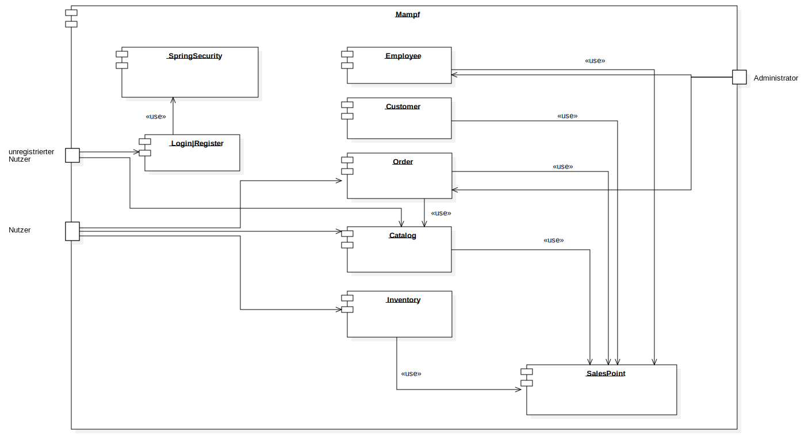

:project_name: Mampf
:doctype: book
:icons: font
:source-highlighter: highlightjs
:numbered:
:toc:
:toc-title: Inhaltsverzeichnis

[options="header"]
[cols="1, 3, 3"]
|===
|Version | Bearbeitungsdatum   | Autor 
|...	| ... | ...
|===

= Entwicklerdokumentation

toc::[]

== Einführung und Ziele
* Aufgabenstellung
* Qualitätsziele

== Randbedingungen
* Hardware-Vorgaben
* Software-Vorgaben
* Vorgaben zum Betrieb des Software

== Kontextabgrenzung

[[context_diagram]]
image:images/diagrams/context_diagram.svg[context diagram]

* Kontextdiagramm

== Lösungsstrategie
=== Erfüllung der Qualitätsziele
[options="header"]
[cols="1,5"]
|=== 
|Qualitätsziel |Lösungsansatz
|Bedienbarkeit
a| * *geringe Einstiegshürde* Es muss sichergestellt werden, dass das Programm
ohne großen Einarbeitungsaufwand sehr schnell benutzt werden kann.
Dazu können eindeutige Beschreibung der Eingabefelder oder sogenannte Tooltips helfen.

* *Fehlerbehandlung / Fehlervermeidung* Benutzer sollen vor Fehlern geschützt werden.
Falsche Eingabe sollen abgefangen werden und keine fatalen Folgen haben.

* *angenehme Bedienoberfläche* Dem Benutzer soll eine intuitive, angenehme Bedienung ermöglicht werden.

* *Barrierefreiheit* Möglichst vielen unterschiedlichen Benutzern mit möglichst
vielen unterschiedlichen Voraussetzungen soll die Benutzung des Systems ermöglicht werden.
Dies kann z.B. durch die Benutzung von ausreichend großen Schriftgrößen, großem Farbkontrast und alternativer Beschriftung von Bilder erfolgen.

| Sicherheit
a| * *Vertraulichkeit* Bestimmte Daten können nur von Personen eingesehen werden, die dazu autorisiert sind.
Das kann z.B. mittels _Spring Security_ und _Thymeleaf_ (`sec:authorize` - tag) umgesetzt werden.

* *Integrität* Daten sollen vor unautorisierter Veränderung geschützt sein. Dies kann mittels _Spring Security_ (`@PreAuthorize`) realisiert werden.

* *Nachverfolgbarkeit* Bestimmte Aktionen müssen eindeutig einem Akteuer zugeordnet werden können. Dazu gehört beispielsweise das Bestellen (`Order`) von Angeboten (`Offer`).

|===

=== Softwarearchitektur

[[top_level_diagram]]

=== Entwurfsentscheidungen
==== Verwendete Muster

* Spring MVC

==== Persistenz
Das Programm benutzt _Hibernate annotation based mapping_, um Java-Klassen automatisch in einer Datenbank zu speichern. Als Datenbank wird _H2_ benutzt.
Die persistente Speicherung kann an- und abgeschaltet werden. Das ist z.B. hilfreich, um die Datenbank mit den Standardwerten wieder herzustellen.
In der Datei _application.properties_ müssen dazu die folgenden Zeilen auskommentiert werden:

 # spring.datasource.url=jdbc:h2:./db/mampf
 # spring.jpa.hibernate.ddl-auto=update

==== Benutzeroberfläche

*TODO: add diagram*

==== Verwendung externer Frameworks

[options="header", cols="1,2"]
|===
|Externes Package |Verwendet von (Klasse der eigenen Anwendung)
|salespointframework.catalog
a| * catalog.Item
* catalog.Catalog
* order.OrderController

| salespointframework.core
a| * catalog.CatalogInitializer
* user.UserInitializer
* employee.EmployeeInitializer
* inventory.InventoryInitializer

|salespointframework.inventory
a| * catalog.CatalogController
* inventory.InventoryController
* inventory.InventoryInitializer

| salespointframework.order
a| * order.OrderController
* catalog.Item
* employee.EmployeeManager

|===

== Bausteinsicht
* Entwurfsklassendiagramme der einzelnen Packages

[options="header"]
|=== 
|Klasse/Enumeration |Description
|...|...
|===

=== Rückverfolgbarkeit zwischen Analyse- und Entwurfsmodell
_Die folgende Tabelle zeigt die Rückverfolgbarkeit zwischen Entwurfs- und Analysemodell. Falls eine Klasse aus einem externen Framework im Entwurfsmodell eine Klasse des Analysemodells ersetzt,
wird die Art der Verwendung dieser externen Klasse in der Spalte *Art der Verwendung* mithilfe der folgenden Begriffe definiert:_

* Inheritance/Interface-Implementation
* Class Attribute
* Method Parameter

[options="header"]
|===
|Klasse/Enumeration (Analysemodell) |Klasse/Enumeration (Entwurfsmodell) |Art der Verwendung
|...|...|...
|===

== Laufzeitsicht
* Darstellung der Komponenteninteraktion anhand eines Sequenzdiagramms, welches die relevantesten Interaktionen darstellt.

== Technische Schulden
* Auflistung der nicht erreichten Quality Gates und der zugehörigen SonarQube Issues zum Zeitpunkt der Abgabe

