= Pflichtenheft {project_name}
:project_name: Mampf
== __{project_name}__
:doctype: book
:icons: font
:source-highlighter: highlightjs
:numbered:
:toc:
:toc-title: Inhaltsverzeichnis

[options="header"]
[cols="1, 1, 1, 1, 4"]
|===
|Version | Status      | Bearbeitungsdatum   | Autoren(en) |  Vermerk
|0.1     | In Arbeit   | 10.10.2020          | Autor       | Initiale Version
|===

toc::[]

== Zusammenfassung
Der Inhalt dieses Dokuments befasst sich mit allen strukturellen und funktionalen Gegebenheiten der zu erstellenden
Software und dient vorallem zur Validierung dementsprechender Elemente durch den Kunden und dem Entwicklungsteam.
Daher wird beschrieben, welche Anforderungen die Software erfüllt und dient gleichermaßen dem Kunden zur Überprüfung
der Implementierung der von ihm gewünschten Features.

Daraus folgt, dass dieses Dokument außerdem als Kontrollstruktur zur Validierung etwaiger Akzeptanzkriterien zu
verstehen ist und sollte daher möglichst vollständig und konsistent sein bzw. gehalten werden.
Alle Änderungen sind daher hier zu vermerken und zu validieren. Implizit ist dadurch außerdem die einfache Möglichkeit
der Erweiterung dieses Dokuments.

== Aufgabenstellung und Zielsetzung

Aufgabenstellung: 

"Cateringservice
Essen und Trinken hält Leib und Seele zusammen“ besagt ein altes deutsches Sprichwort.
Das dachte sich auch Hannes Wurst und baute seinen kleinen Imbissstand zu dem inzwischen
renommierten Cateringservice Mampf mit vielen Angestellten und guter Auftragslage aus.
Jetzt möchte er endlich auch eine Software haben, mit der er alle Abrechnungs-, Bestell- und
Verwaltungsaufgaben einheitlich bearbeiten kann. Bisher nutze Herr Wurst dafür diverse
Programme und ärgerte sich immer wieder über deren Inkompatibilität zueinander und den
Mehraufwand durch getrennte Datenhaltung. Als Basis für die Softwareentwicklung gab er
uns folgende Beschreibung seines kleinen Unternehmens:
Mampf gliedert sich in vier Geschäftsfelder. Das Eventcatering übernimmt die Verpflegung
bei großen Veranstaltungen, egal ob in Form eines Buffetts oder als Galadinner. Auf Wunsch
gestaltet Mampf auch das komplette Event, d.h. neben den Speisen und Getränken wird auch
Dekoration, Ausrüstung (also Geschirr, Tischtücher usw.) und Personal zur Verfügung
gestellt, wobei der Kunde dann natürlich zusätzlich zum eigentlichen Preis für Lebensmittel
und Arbeitszeit auch Leihgebühren und Personalkosten bezahlen muss. Der Partyservice
beliefert private Feierlichkeiten mit kalten Platten – von Hochzeiten und Beerdigungen über
Gartenfeste bis zu Omas 75sten Geburtstag. Hierbei gibt es Festpreise je nach Angebot und
Personenanzahl (z.B. Schinkenplatte für 5 Personen zu 20,- EUR, Käseplatte für 3 Personen
zu 12,50 EUR usw.) und Sonderaktionen (z.B. Sushi-Abend für 10 Personen). Eine
Besonderheit von Mampf ist Mobile Breakfast – ein mobiler Frühstücksservice für kleinere
Firmen ohne eigene Kantine. Zu festgelegten Zeiten können die Mitarbeiter sozusagen am
Arbeitsplatz eine Auswahl an Frühstücksangeboten (belegte Brötchen, Müsli, Kaffee und Tee
usw.) kaufen. Die Firmen buchen das Angebot monateweise. Problematisch ist allerdings die
Planung dieses Angebotes – hier wird derzeit noch nach einer kostensparenden Lösung (z.B.
in Form einer Vorbestellung) gesucht. Immer beliebter wird bei den Kunden auch das vierte
Angebot von Mampf: Rent-a-Cook. Dabei wird Küchen- und Servicepersonal an
Privathaushalte verliehen, um z.B. den Chef des Gastgebers mit kulinarischen Köstlichkeiten
zu beeindrucken. Um die Lebensmittel müssen sich die Kunden dabei selbst kümmern.
Hannes Wurst hat nun ganz genaue Vorstellungen von der zu entwickelnden Software: Sie
soll die Kundenverwaltung unterstützen, die Personalverwaltung und -zuteilung übernehmen,
die Termine planen, das Zubehör (Dekoration, Ausrüstung) verwalten, den
Lebensmittelbedarf bestimmen (Anzahl Gerichte/Platten/belegte Brötchen, Menge an
Getränken in Liter), die Rechnungsstellung an die Kunden vereinfachen und sämtliche
Abrechnungen erleichtern. Die Lebensmittelbeschaffung muss nicht betrachtet werden, durch
die langjährigen Erfahrungen bei Mampf ist der Einkaufspreis pro Gericht/Platte/Getränk
jedoch bekannt."

Diese Software soll dem Betreiber und seinen potentiellen Kunden eine einfachere und schnellere Möglichkeit der
Kommunikation und Interaktion bieten. Potentielle Kunden sollen ein festes Konto besitzen, sich also registrieren können
und dadurch eine schnellere Übersicht über das gesamte Angebot bekommen und dadurch auch schneller und einfacher
bestellen können. Gleichwohl soll der Inhaber eine bessere und automatisierte Übersicht über alle Bestellungen bekommen,
welche dadurch auch einfacher zu administrieren sind. Außerdem hat der Inhaber durch diese Software die Möglichkeit
seine Kunden schneller und kostengünstiger von neuen Angeboten und neuen Produkten zu informieren. Da es nur um einen
Cateringservice geht wird auf sicherste Authentifizierungsmechanismen verzichtet und lediglich ein Passwort benötigt.
Zusätzlich soll jeder Besucher des Services die Möglichkeit besitzen sich auch ohne Registrierung einen Überblick über
die Angebote zu machen.

Die Software soll ansprechend und einladend aussehen und möglichst einfach aufgebaut sein damit sich jeder Benutzer zurecht findet, was gleichermaßen bedeutet dass sich an bestehende Designs angepasst wird.

== Produktnutzung
Folgende Randbedingungen werden bei der Veröffentlichung der Software benötigt:

Diese Software wird vom Kunden selbst auf einem Server seiner Wahl gehostet und das Entwicklerteam übernimmt keinerlei Verantwortung für das Deployment auf eben jenem. Die Software soll später rund um die Uhr im Internet zur Verfügung gestellt werden, ausschließlich als Webapp.

Das System soll für die folgenden Browser zugänglich und visuell optimiert sein:

Mozilla Firefox, Version 55.0.3+

Google Chrome, Version 61.0.3163+

Die primäre Ziegruppe ergibt sich vorallem aus Menschen jeglicher Gesellschaftsschicht, die tagtäglich im Internet
surfen und somit elementare Kenntnisse der Bedienung einer Website mitbringen.
Zusätzlich dazu gibt es einen Administrator (Chef) der die Inhalte pflegt und Personal verwaltet ohne über
einen beruflich informationstechnischen Hintergrund zu verfügen.

Daten werden in einer relationalen Datenbank gespeichert und können ohne jegliche Kenntnisse permanent
vom Chef eingesehen werden.

== Interessensgruppen (Stakeholders)
Im folgenden sind alle Personen aufgelistet, die einen Einfluss auf den Entwicklungsprozess haben können.
Zur besseren Konflikt- und Problembewältigung wird jeder Personengruppe eine Priorität zugeordnet um festzulegen,
wer im Streitfall letztendlich die Entscheidung fällt.

[options="header", cols="2, ^1, 4, 4"]
|===
|Name
|Priorität (1..5)
|Beschreibung
|Ziele

|Mampf
|5
|Kunde bzw. Tutor dieses Projektes
a|
- Mehr Aufträge und Kundenzuwachs
- Automatisierung der Bestell- und Personalprozesse
- Bessere Übersicht über Bedarf und Verbrauch aller Waren

|Kunden
|4
|Eigentliche Kunde des Catering-Services
a|
- Intuitive Interaktion mit der Website
- Einfacher Bestellvorgang
- Bessere und einfache Übersicht über alle Produkte

|Administratoren
|2
|Benutzer die die Software verwalten (Chef u.a.)
a|
- Überblicken und editieren jeglicher Daten im System
- (Bestell-)Vorgänge und Personal verwalten

|Entwickler
|3
|Alle Studenten die für die Entwicklung der Software zuständig sind
a|
- Einwandfrei funktionierende, getestete und erweiterbare Software
- Keinen Wartungsaufwand

|===

== Systemgrenze und Top-Level-Architektur

=== Kontextdiagramm
Kontextdiagramm der Software

[[context_diagram]]
image:images/diagrams/context_diagram.svg[context diagram]

=== Top-Level-Architektur
Top-Level-Architektur der Sdoftware

[[top_level_diagram]]
image:images/diagrams/top_level_arch.svg[top level architexture]

== Anwendungsfälle

Dieses Kapitel gibt einen Überblick über die typischen Anwendungsfälle.
Dabei wird von der Sicht des Anwenders ausgehend eine Beschreibung vorgenommen.

=== Akteure

// See http://asciidoctor.org/docs/user-manual/#tables
[options="header"]
[cols="1,4"]
|===
|Name |Beschreibung
| Benutzer / User
| repräsentiert alle Personen, die mit dem Programm interagieren. Dabei spielt es keine Rolle, ob der Benutzer angemeldet ist oder nicht.

| Registrierter / angemeldeter Benutzer
| Dieser Begriff meint alle Personen, welche einen Account haben, angemeldet sind und mit dem Programm interagieren.

| nicht angemeldeter Benutzer
| repräsentiert aller Personen, die nicht angemeldet sind und mit dem Programm interagieren.
Dabei steht ihnen nur eine eingeschränkte Funktionalität zur Verfügung.

| Administrator
| Dieser Begriff meint alle angemeldeten Benutzer, die die Rolle <<customer, "ADMIN">> besitzen. Diese sind verantwortlich für das Administrieren des Programms.

| Kunden / Customer
| Dieser Begriff meint alle angemeldeten Benutzer, die die Rolle <<customer, "CUSTOMER">> besitzen.
Nur Benutzern mit dieser Rolle ist das Kaufen von Angebote aus dem Warenkorb erlaubt.

|===

=== Überblick Anwendungsfalldiagramm
Anwendungsfall-Diagramm, das alle Anwendungsfälle und alle Akteure darstellt
[[useCaseDiagram]]

=== Anwendungsfallbeschreibungen
[cols="1h, 3"]
[[UC0010]]
|===
|ID                         |**<<UC0010>>**
|Name                       | Anmelden/Abmelden
|Description                | Ein Benutzer kann sich anmelden, um bestimmte Aktionen mit dem Programm ausführen zu können.
Nach Ausführung aller Aktionen soll sich ein Benutzer abmelden können.
|Actors                     | Benutzer
|Trigger                    |
_Anmelden_: Der Benutzer möchte Aktionen durchführen, die eine Anmeldung voraussetzen.

_Abmelden_: Der Benutzer möchte das Mampf-Programm nicht weiter benutzen.
|Precondition(s)           a|
_Anmelden_: Der Benutzer ist noch nicht angemeldet.

_Abmelden_: Der Benutzer ist bereits angemeldet.
|Essential Steps           a|
_Anmelden_:

1. Der Benutzer wählt im Menu den Button "Anmelden" aus.
2. Der Benutzer gibt seine Anmeldedaten ein.
3. Der Benutzer klickt auf "Anmelden".

_Abmelden_:

1. Der Benutzer klickt auf "Abmelden".
2. Der Benutzer wird abgemeldet und auf den Startbildschirm umgeleitet.

|Extensions                 |-
|Functional Requirements    |<<F0010>>
|===

[cols="1h, 3"]
[[UC0020]]
|===
|ID                         |**<<UC0020>>**
|Name                       |Registrieren
|Description                |Eine Person, die noch keinen Zugang zu dem Programm hat, kann für sich selbst einen neuen Account erstellen.
|Actors                     |Unangemeldeter Benutzer
|Trigger                    |Ein unangemeldeter Benutzer möchte durch anklicken von "Registrieren" einen Benutzerzugang für sich erstellen.
|Precondition(s)           a|Der Benutzer ist nicht angemeldet
|Essential Steps           a|
1.  Nicht angemeldeter Benutzer klickt "Registrieren" an.
2.  Er gibt seinen Benutzernamen und sein Password ein.
3.  Das Programm validiert die Eingaben.
. Wenn es korrekte Eingaben waren, wird der Benutzer erstellt.
. Ansonsten wird eine Fehlermeldung angezeigt.
|Extensions                 |-
|Functional Requirements    |<<F0020>>, <<F0021>>
|===

[[UC0100]]
[cols="1h, 3"]
|===
|ID                         |**<<UC0100>>**
|Name                       |**Katalog ansehen**
|Description                | Jeder Benutzer kann sich den Inhalt des Katalogs ansehen. Dieser enthält alle Angebote. Die Angebote müssen nach ihrer <<offerCategory,Kategorie>> gefiltert werden.
|Actors                     | Benutzer
|Trigger                    | Der Benutzer klickt im Menu das Element "Katalog" an.
|Precondition(s)           a| keine
|Essential Steps           a|1. Der Benutzer klickt im Menu die einzelnen Kategorien an.
2. Dem Benutzer werden alle Angebote einer Kategorie angezeigt.
|Extensions                 | -
|Functional Requirements    | <<F0100>>, <<F0110>>, <<F0111>>, <<F0112>>
|===

[[view_catalog_sd]]
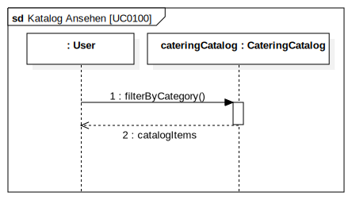

[cols="1h,3"]
[[UC0101]]
|===
|ID                         |**<<UC0101>>**
|Name                       | Katalogeinträge erstellen / bearbeiten / löschen
|Description                | Dem Administrator soll es möglich sein, Katalogeinträge zu verändern.
|Actors                     | <<customer,Administrator>>
|Trigger                    | Admin klickt im Menu "Katalog" auf die Details eines Angebots.
|Precondition(s)           a|
- Der angemeldete Benutzer hat die Rolle "ADMIN" im Programm.
- Der Admin klickt im Menu auf "Katalog".
|Essential Steps           a|
1.  Der Admin klickt im Menu "Katalog" auf ein bestimmtes Angebot oder auf den Button "neues Angebot hinzufügen".
2.  Dem Administrator erhält die Möglichkeit, das gewählte Angebot zu bearbeiten, zu löschen oder ein neues hinzuzufügen.
|Extensions                 | -
|Functional Requirements    | <<F0101>>
|===

[[add_offer]]

[[edit_offer]]

[[remove_offer]]
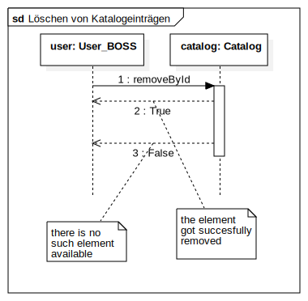

[[UC0110]]
[cols="1h, 3"]
|===
|ID                         |**<<UC0110>>**
|Name                       |Angebotsdetails ansehen
|Description                |Ein Benutzer soll die Möglichkeit haben, alle Details eines Angebots sich anzusehen.
|Actors                     |Benutzer
|Trigger                    |Ein Benutzer sieht sich alle Angebote einer Kategorie an und klickt auf ein Angebot.
|Precondition(s)           a|Ein Benutzer sieht sich den Katalog an.
|Essential Steps           a|
1.  Der Benutzer klickt auf ein Angebot im Katalog.
2.  Dem Benutzer werden die Details des Angebots angezeigt.
|Extensions                 |-
|Functional Requirements    | <<F0120>>
|===

[[view_details_catalog_sd]]

[cols="1h,3"]
[[UC0200]]
|===
|ID                         |**<<UC0200>>**
|Name                       |Angebot zum Warenkorb hinzufügen
|Description                |Ein angemeldeter Nutzer soll in der Lage sein, ein Angebot in einer gewählten Anzahl zum Warenkorb hinzuzufügen.
|Actors                     |Angemeldeter Benutzer
|Trigger                    |Ein angemeldeter Benutzer sieht sich die Details eines Angebotes an und möchte Einige zu seinem Warenkorb hinzufügen.
|Precondition(s)           a|
- Der Benutzer ist angemeldet.
- Der angemeldete Benutzer sieht sich die Details eines Angebotes an.
|Essential Steps           a|
1.  Der Benutzer gibt eine gewünschte Anzahl an Angeboten ein.
2.  Der Benutzer klickt "Zum Warenkorb hinzufügen" an.
3.  Das Angebot wird in der gewünschten Anzahl zu seinem Warenkorb hinzugefügt.
|Extensions                 |-
|Functional Requirements    | <<F0200>>, <<F0201>>
|===

[[add_item_to_cart_sd]]

[cols="1h,3"]
[[UC0202]]
|===
|ID                         |**<<UC0202>>**
|Name                       | Warenkorb ansehen
|Description                | Ein angemeldeter Benutzer hat die Möglichkeit, alle Inhalte in seinem Warenkorb und den Gesamtpreis anzusehen.
|Actors                     | Angemeldeter Benutzer
|Trigger                    | Der angemeldete Benutzer klickt im Menü "Warenkorb" an.
|Precondition(s)           a|
- Der Benutzer ist angemeldet.
|Essential Steps           a|
1.  Der angemeldete Benutzer klickt im Menü "Warenkorb" an.
2.  Dem Benutzer wird der Inhalt seines Warenkorbs mit dem Gesamtpreis angezeigt.
|Extensions                 |-
|Functional Requirements    | <<F0202>>
|===

[[home_image]]
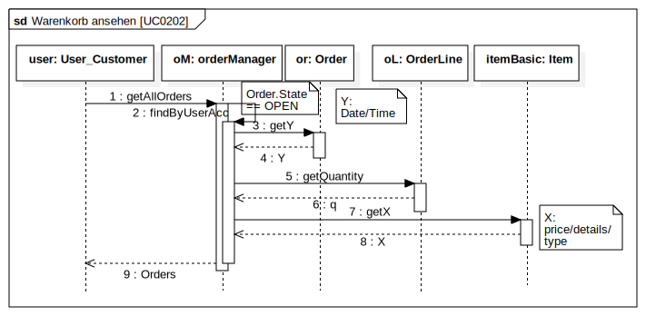

[cols="1h,3"]
[[UC0210]]
|===
|ID                         |**<<UC0210>>**
|Name                       | Warenkorb leeren
|Description                | Ein angemeldeter Benutzer hat die Möglichkeit, alle Inhalte aus seinem Warenkorb zu entfernen.
|Actors                     | Angemeldeter Benutzer
|Trigger                    | Der angemeldete Benutzer klickt im "Warenkorb" auf den Button "Leeren".
|Precondition(s)           a|
- Der Benutzer ist angemeldet.
- Der angemeldete Benutzer klickt im Menü "Warenkorb" an.
|Essential Steps           a|
1.  Der angemeldete Benutzer klickt im "Warenkorb" auf den Button "Leeren".
2.  Dem Benutzer wird der leere Warenkorb angezeigt.
|Extensions                 |-
|Functional Requirements    | <<F0210>>
|===

[[empty_cart]]

[cols="1h,3"]
[[UC0220]]
|===
|ID                         |**<<UC0220>>**
|Name                       | Angebote im Warenkorb kaufen
|Description                |Ein Kunde soll in der Lage sein, Angebote aus dem Warenkorb zu kaufen.
|Actors                     | <<customer,Kunde>>
|Trigger                    | Kunde klickt auf "Kaufen".
|Precondition(s)           a|
- Der angemeldete Benutzer hat die Rolle "CUSTOMER" im Programm.
- Der Warenkorb ist nicht leer.
|Essential Steps           a|
1.  Der Kunde drückt auf "Kaufen"
2.  Der Kunde gibt einen Termin, eine Adresse und eine Zahlungsmethode an.
3.  Der Kunde klickt auf "Bestätigen".
4.  Das Programm prüft, ob zu dem gewünschten Zeitpunkt noch ausreichend Ressourcen vorhanden sind.
5.  Die Bestellung wird mit der gewählten Bezahlmöglichkeit bezahlt.
6.  Es wird hinterlegt, welche Angebote der Kunde zu welchem Zeitpunkt benötigt. Damit werden die entsprechenden Ressourcen im Programm reserviert.
|Extensions                 | -
|Functional Requirements    | <<F0220>>, <<F0230>>, <<F0240>>, <<F0241>>, <<F0242>>
|===

[[home_image]]

[cols="1h,3"]
[[UC0243]]
|===
|ID                         |**<<UC0243>>**
|Name                       | Bestellübersicht ansehen
|Description                | Ein Kunde soll in der Lage sein, sich über den Status seiner Bestellung zu informieren.
|Actors                     | <<customer,Kunde>>
|Trigger                    | Kunde klickt im Menu auf "Meine Bestellungen"
|Precondition(s)           a|
- Der angemeldete Benutzer hat die Rolle "CUSTOMER" im Programm.
- Der Kunde hat bereits eine Bestellung aufgegeben.
|Essential Steps           a|
1.  Der Kunde klickt im Menu auf "Meine Bestellungen".
2.  Dem Kunden werden alle von ihm getätigten Bestellungen angezeigt. +
Dabei werden ihm die Details angezeigt:
. Auflistung aller bestellten Angebote samt Anzahl
. Datum für die Lieferung
. <<orderState,Status der Bestellung>> bzw. ein erklärender Hinweis dazu
|Extensions                 | -
|Functional Requirements    | <<F0243>>
|===

[[view_all_orders_of_user_sd]]
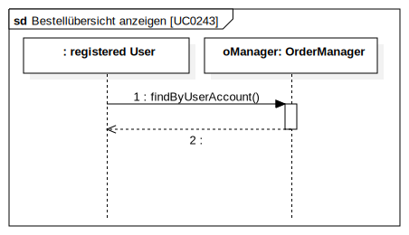

[cols="1h,3"]
[[UC0400]]
|===
|ID                         |**<<UC0400>>**
|Name                       | Rechnung ansehen
|Description                | Ein Kunde soll in der Lage sein, sich die Rechnung jeder Bestellung anzeigen zu lassen.
|Actors                     | <<customer,Kunde>>
|Trigger                    | Der Kunde klickt im Menu auf "Bestellungen".
|Precondition(s)           a|
- Der angemeldete Benutzer hat die Rolle "CUSTOMER" im Programm.
- Ein Kunde hat bereits eine Bestellung aufgegeben.
- Der Kunde klickt in der Ansicht "Meine Bestellungen" auf eine bestimmte Bestellung.
|Essential Steps           a|
1.  Der Kunde klickt auf eine bestimmte Bestellung.
2.  Dem Kunden wird die Rechnung für diese Bestellung angezeigt.
|Extensions                 | -
|Functional Requirements    | <<F0400>>
|===

[cols="1h,3"]
[[UC0300]]
|===
|ID                         |**<<UC0300>>**
|Name                       | Liste aller Kunden
|Description                | Dem Administrator soll es möglich sein, sich alle Kunden anzeigen zu lassen.
|Actors                     | <<customer,Administrator>>
|Trigger                    | Admin klickt im Menu auf "Kunden".
|Precondition(s)           a|
- Der angemeldete Benutzer hat die Rolle "ADMIN" im Programm.
- Es hat sich bereits mindestens ein Kunde registriert.
|Essential Steps           a|
1.  Der Admin klickt im Menu auf "Kunden".
2.  Dem Administrator werden alle Kunden angezeigt.
|Extensions                 | -
|Functional Requirements    | <<F0300>>
|===

[cols="1h,3"]
[[UC0301]]
|===
|ID                         |**<<UC0301>>**
|Name                       | Entfernen von Kunden
|Description                | Dem Administrator soll es möglich sein, einzelnen Kunden die Anmeldung zu verbieten.
|Actors                     | <<customer,Administrator>>
|Trigger                    | Admin klickt im Menu "Kunden" auf "Kunde löschen".
|Precondition(s)           a|
- Der angemeldete Benutzer hat die Rolle "ADMIN" im Programm.
- Es hat sich bereits mindestens ein Kunde registriert.
- Der Admin klickt im Menu auf "Kunden".
|Essential Steps           a|
1. In der Übersicht über alle Kunden klickt er bei einem bestimmten Kunden auf den Button "Kunde löschen".
2. Dem Administrator wird die aktualisierte Liste aller Kunden angezeigt.
|Extensions                 | -
|Functional Requirements    | <<F0301>>
|===

[[remove_user]]

[cols="1h,3"]
[[UC0310]]
|===
|ID                         |**<<UC0310>>**
|Name                       | Liste aller Bestellungen
|Description                | Dem Administrator soll es möglich sein, sich alle Bestellungen detailliert anzeigen zu lassen.
|Actors                     | <<customer,Administrator>>
|Trigger                    | Der Administrator klickt im Menu auf "Bestellungen".
|Precondition(s)           a|
- Der angemeldete Benutzer hat die Rolle "ADMIN" im Programm.
- Es wurde bereits von mindestens einem Kunden eine Bestellung aufgegeben.
|Essential Steps           a|
1.  Der Admin klickt im Menu auf "Bestellungen".
2.  Dem Administrator werden alle Bestellungen angezeigt.
|Extensions                 | -
|Functional Requirements    | <<F0310>>
|===

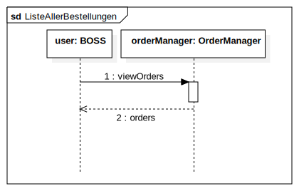

[cols="1h,3"]
[[UC0320]]
|===
|ID                         |**<<UC0320>>**
|Name                       | Ansehen des Inventars
|Description                | Dem Administrator soll es möglich sein, sich das Inventar und alle verfügbaren Ressourcen anzeigen zu lassen.
|Actors                     | <<customer,Administrator>>
|Trigger                    | Admin klickt im Menu auf "Inventar".
|Precondition(s)           a|
Der angemeldete Benutzer hat die Rolle "ADMIN" im Programm.
|Essential Steps           a|
1.  Der Admin klickt im Menu auf "Inventar".
2.  Dem Administrator wird das Inventar mit allen verfügbaren Ressourcen angezeigt.
|Extensions                 | -
|Functional Requirements    | <<F0100>>, <<F0340>>
|===

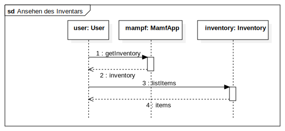

[cols="1h,3"]
[[UC0330]]
|===
|ID                         |**<<UC0330>>**
|Name                       | Übersicht über die Personalzuteilung
|Description                | Dem Administrator soll es möglich sein, sich die bisher vorgenommene Personalzuteilung ausgeben zu lassen.
|Actors                     | <<customer,Administrator>>
|Trigger                    | Admin klickt im Menu auf "Personal".
|Precondition(s)           a|
Der angemeldete Benutzer hat die Rolle "ADMIN" im Programm.
|Essential Steps           a|
1.  Der Admin klickt im Menu auf "Personal".
2.  Dem Administrator wird die Zuteilung des Personals zu allen Bestellungen angezeigt.
|Extensions                 | -
|Functional Requirements    | <<F0320>>
|===

[cols="1h,3"]
[[UC0331]]
|===
|ID                         |**<<UC0331>>**
|Name                       | Personalzuteilung vornehmen
|Description                | Dem Administrator soll es möglich sein, Bestellungen sein Personal zuzuteilen.
|Actors                     | <<customer,Administrator>>
|Trigger                    | Admin klickt im Menu "Bestellungen" auf die Details einer Bestellung.
|Precondition(s)           a|
- Der angemeldete Benutzer hat die Rolle "ADMIN" im Programm.
- Der Admin klickt im Menu auf "Bestellungen".
|Essential Steps           a|
1.  Der Admin klickt im Menu "Bestellungen" auf eine bestimmte Bestellung.
2.  Dem Administrator erhält die Möglichkeit, sein Personal dieser Bestellung zuzuteilen.
|Extensions                 | -
|Functional Requirements    | <<F0320>>
|===

[cols="1h,3"]
[[UC0341]]
|===
|ID                         |**<<UC0341>>**
|Name                       | Ansicht / Filtern des gesamten Personals
|Description                | Dem Administrator soll es möglich sein, sich sein gesamtes Personal anzeigen zu lassen.
|Actors                     | <<customer,Administrator>>
|Trigger                    | Admin klickt im Menu auf den Button "Mitarbeiter".
|Precondition(s)           a|
- Der angemeldete Benutzer hat die Rolle "ADMIN" im Programm.
- Der Admin klickt im Menu auf "Mitarbeiter".
|Essential Steps           a|
1.  Dem Admin wird sein gesamtes angestelltes Personal angezeigt. +
Dabei kann er sich dieses nach "Koch" oder "Servicepersonal" filtern lassen.
|Extensions                 | -
|Functional Requirements    | <<F0322>>
|===

[[filter_employees]]

[cols="1h,3"]
[[UC0342]]
|===
|ID                         |**<<UC0342>>**
|Name                       | neues Personal einstellen
|Description                | Dem Administrator soll es möglich sein, neues Personal einzustellen.
|Actors                     | <<customer,Administrator>>
|Trigger                    | Admin klickt im Menu "Mitarbeiter" auf den Button "Koch/Personal hinzufügen"
|Precondition(s)           a|
- Der angemeldete Benutzer hat die Rolle "ADMIN" im Programm.
- Der Admin klickt im Menu auf "Mitarbeiter".
|Essential Steps           a|
1.  Der Admin klickt im Menu "Mitarbeiter" entweder auf den Button "Köche hinzufügen" oder auf den Button "Personal hinzufügen".
2.  Dem Administrator erhält die Möglichkeit, den Namen des neuen Personals einzugeben.
|Extensions                 | -
|Functional Requirements    | <<F0321>>
|===

[[hire_employees]]

[cols="1h,3"]
[[UC0344]]
|===
|ID                         |**<<UC0344>>**
|Name                       | Personal löschen, Personal bearbeiten
|Description                | Dem Administrator soll es möglich sein, Personal zu löschen oder zu bearbeiten.
|Actors                     | <<customer,Administrator>>
|Trigger                    | Admin klickt im Menu "Mitarbeiter" für einen bestimmten Mitarbeiter auf den Button "löschen".
|Precondition(s)           a|
- Der angemeldete Benutzer hat die Rolle "ADMIN" im Programm.
- Der Admin klickt im Menu auf "Mitarbeiter".
|Essential Steps           a|
1.  Der Admin klickt im Menu "Mitarbeiter" für einen bestimmten Mitarbeiter auf den Button "löschen" bzw "bearbeiten".
2.  Dem Administrator wird die aktualisierte Liste seiner Mitarbeiter angezeigt.
|Extensions                 | -
|Functional Requirements    | <<F0323>>
|===

[[fire_employees]]
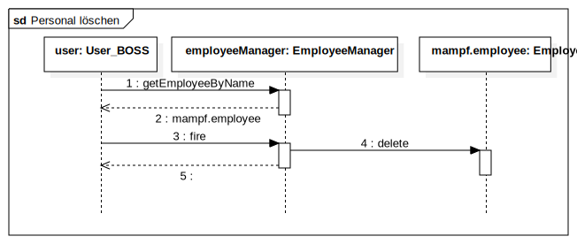

[[edit_employees]]
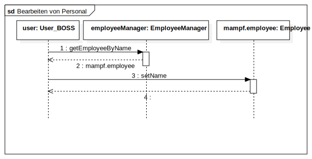

[cols="1h,3"]
[[UC0420]]
|===
|ID                         |**<<UC0420>>**
|Name                       | Umsatzansicht
|Description                | Dem Administrator soll es möglich sein, sich für jeden Monat den gesamten Umsatz anzeigen zu lassen.
|Actors                     | <<customer,Administrator>>
|Trigger                    | Admin klickt im Menu "Umsätze" auf einen bestimmten Monat.
|Precondition(s)           a|
- Der angemeldete Benutzer hat die Rolle "ADMIN" im Programm.
- Der Admin klickt im Menu auf "Umsätze".
|Essential Steps           a|
1.  Der Admin klickt im Menu "Umsätze" auf einen der angezeigten Monate.
2.  Dem Administrator werden alle Umsätze des jeweiligen Monats angezeigt.
|Extensions                 | -
|Functional Requirements    | <<F0323>>
|===

[[show_revenue]]

== Funktionale Anforderungen

=== Muss-Kriterien
Was das zu erstellende Programm auf alle Fälle leisten muss.

[options="header]
[cols="1,2,3,4"]
|===
| ID
| Version
| Name
| Beschreibung

| [[F0010]]<<F0010>>
| v0.1
| Anmelden
a| Das Programm unterscheidet zwischen öffentlich sichtbaren und nur nach Anmeldung sichtbaren Teilen.
Dabei kann ein im Programm registrierter Nutzer sich mit den Identifikationsmerkmalen anmelden:

* Benutzername

*  Passwort

| [[F0020]]<<F0020>>
| v0.1
| Registrieren
a| Das Programm soll die Möglichkeit für nicht angemeldete Nutzer bieten,
sich über ein Menu-Element "Registrieren" im System zu registrieren.
Dabei müssen folgende Informationen angegeben werden:

* Benutzername (eindeutig)

* Vor- und Nachname (für die Rechnung)

* Passwort

| [[F0021]]<<F0021>>
| v0.1
| Registrierung validieren
a| Das Programm muss validieren, dass die Eingaben korrekt sind und der Benutzername eindeutig ist.

Bei einem Fehler muss der Benutzer in Kenntnis gesetzt werden.

| [[F0100]]<<F0100>>
| v0.1
| Inventar von Angeboten
a| Das Programm muss alle Informationen über die Anzahl der verfügbaren Angebote persistent speichern.

| [[F0101]]<<F0101>>
| v0.1
| Hinzufügen, Verändern oder Löschen von Angeboten
a| Das Programm muss einem Administrator die Möglichkeit bieten,
neue Angebote zu erstellen oder bestehende Angebote zu bearbeiten oder zu entfernen.

| [[F0102]]<<F0102>>
| v0.1
| Verändern vom Inventar
a| Das Programm muss einem Administrator die Möglichkeit bieten,
die Anzahl von Angeboten im Inventar zu verändern.

| [[F0110]]<<F0110>>
| v0.1
| Katalog
a| Das Programm muss alle Angebote in einem Katalog zur Verfügung stellen. 
Dabei muss trotzdem die Möglichkeit bestehen Angebote hinzuzufügen, zu verändern und zu löschen 

| [[F0111]]<<F0111>>
| v0.1
| Ansehen der Angebote
a| Das Programm muss einem Benutzer es ermöglichen, den Inhalt des Katalogs sich anzusehen.

| [[F0112]]<<F0112>>
| v0.1
| Filtern des Katalogs
a| Das Programm muss einem Benutzer es ermöglichen, den Katalog nach verschiedenen Kriterien zu filtern.

Z.b. muss die Filterung nach der Kategorie des Angebots
(Eventcatering, Partyservice, Mobile Breakfast, Rent a cook) erfolgen.

| [[F0120]]<<F0120>>
| v0.1
| Ansehen der Angebotsdetails
a| Das Programm muss dem Benutzer die Möglichkeit geben, sich über alle Details eines Angebots zu informieren.
Dazu gehören:

* Titel des Angebots

* Beschreibung des Angebots

* Preis des Angebots

* Verfügbarkeit

| [[F0200]]<<F0200>>
| v0.1
| Warenkorb
a| Jeder registrierte, angemeldete Benutzer muss die Möglichkeit haben,
in einem Warenkorb temporär während einer Sitzung seine präferierten Angebote zu speichern.

Er soll für jeden Nutzer eindeutig sein.

| [[F0201]]<<F0201>>
| v0.1
| Angebot zum Warenkorb hinzufügen
a| Das Programm muss es einem registrierten, angemeldeten Benutzer ermöglichen, beliebige Angebot zu einem bestimmten Termin
in einer wählbaren Anzahl zu seinem Warenkorb hinzufügen.

Ein entsprechender Eintrag muss im Warenkorb des Benutzers vorgenommen werden.

Nicht registrierte oder nicht angemeldete Benutzer sollen zur Anmeldeansicht weitergeleitet werden.

| [[F0202]]<<F0202>>
| v0.1
| Angebote im Warenkorb ansehen
a| Das Programm muss einem angemeldeten Benutzer die Möglichkeit geben, alle in seinem Warenkorb abgelegten Angebote
sich anzusehen. Dabei muss dem Benutzer folgendes angezeigt werden:

* Angebotsname

* Ausgewählte Anzahl

* Ausgewähltes Datum

* Gesamtpreis pro Angebot (Angebotspreis * ausgewählte Anzahl)

* Gesamtpreis des Warenkorbs

| [[F0210]]<<F0210>>
| v0.2
| Warenkorb leeren
a| Das Programm muss einem angemeldeten Benutzer die Möglichkeit geben, seinen Warenkorb zu leeren.
Dabei wird der gesamte Inhalt seiner Warenkorbs auf einmal entfernt.

| [[F0220]]<<F0220>>
| v0.1
| Angebote aus dem Warenkorb kaufen
a| Das Programm ermöglicht es einem angemeldeten Benutzer, alle Angebote aus seinem Warenkorb zu kaufen.
Dabei muss validiert werden (<<F0230>>), dass zum angegebenen Zeitpunkt ausreichend Ressourcen
für die gewünschten Angebote zur Verfügung stehen.

Wenn dies der Fall ist, soll eine Bestellung erstellt werden (<<F0241>>).

| [[F0230]]<<F0230>>
| v0.1
| Validierung einer Bestellung
a| Das Programm muss überprüfen, ob für einen bestimmten Termin ausreichend Ressourcen verfügbar sind.

| [[F0240]]<<F0240>>
| v0.1
| Bestellungen
a| Das Programm muss Bestellungen und deren Status persistent speichern.

| [[F0241]]<<F0241>>
| v0.1
| Bestellung erstellen
a| Das Programm muss Bestellungen mit dem Inhalt des Warenkorbs eines Benutzers erstellen können.

Dabei wird der Status des Bestellvorgangs mit "OPEN" initialisiert.

| [[F0242]]<<F0242>>
| v0.1
| Bestellungen bezahlen
a| Das Programm muss dem Benutzer die Möglichkeit geben, eine Bestellung mit dem Status "OPEN" mit den Bezahlmöglichkeiten
"bar", "Nachnahme/Rechnung" zu bezahlen.

Danach muss das Programm den Status der Bestellung auf "PAID" setzen.

| [[F0243]]<<F0243>>
| v0.1
| Bestellungsstatus anzeigen
a| Das Programm muss dem Benutzer die Möglichkeit geben, sich über den Status seiner getätigten Bestellungen zu informieren.

Dabei sollte bei Bestellungen mit dem Status "CANCELLED" eine entsprechende Benachrichtigung angezeigt werden.

Bei Bestellungen mit dem Status "COMPLETED" muss die Ansicht der Rechnung möglich sein (<<F0400>>.

| [[F0244]]<<F0244>>
| v0.1
| Bestellungen archivieren
a| Das Programm muss es ermöglichen, Bestellvorgänge zu archivieren. Dabei sollte dies nur erfolgen,
wenn der betreffende Vorgang keine Zuweisung von Personal erfordert.

Dann soll der Bestellstatus auf "COMPLETED" gesetzt werden.

| [[F0300]]<<F0300>>
| v0.1
| Liste aller Kunden
a| Das Programm muss einem Administrator eine Ansicht aller registrierten Kunden zur Verfügung stellen.

| [[F0301]]<<F0301>>
| v0.2
| Kunden entfernen
a| Das Programm muss einem Administrator die Möglichkeit geben, Kunden aus dem Programm zu löschen.
Dabei sollen alle Daten zu Bestellungen zwecks Abrechnungen erhalten bleiben. +
Es darf dem Benutzer nur nicht mehr möglich sein, sich anzumelden.

| [[F0310]]<<F0310>>
| v0.1
| Liste aller Bestellungen
a| Dem Administrator muss eine Ansicht aller Bestellvorgänge zur Verfügung gestellt werden können.
Dabei muss der Administrator zwischen den Bestellungen mit dem Status "PAID" und dem Status "COMPLETED" unterscheiden können.

| [[F0311]]<<F0311>>
| v0.1
| Zuweisung von Personal zu einer Bestellung
a| Dem Administrator muss es möglich sein, zu jeder Bestellung die eine Zuweisung von Personal erfordert, dies zu erledigen.

Anschließend sollte der Status der Bestellung auf "COMPLETED" gesetzt werden.

Kann aufgrund fehlender Kapazitäten die Bestellung nicht angenommen werden, ist der Bestellstatus auf "CANCELLED" zu setzen.

| [[F0320]]<<F0320>>
| v0.1
| Personalzuteilung ansehen
a| Das Programm muss es dem Administrator ermöglichen, sich anzusehen, welches Personal zu welcher Bestellung zugewiesen wurde.
Dabei muss es möglich sein, sich die notwendigen Details der Bestellung anzeigen zu lassen.

| [[F0321]]<<F0321>>
| v0.1
| Personal einstellen
a| Das Programm muss es dem Administrator ermöglichen, neues Personal einzustellen und dabei den Typ des Personals festzulegen. +
Es gibt dabei:

* Köche +
* Servicepersonal +

| [[F0322]]<<F0322>>
| v0.2
| Personal ansehen und filtern
a| Das Programm muss es dem Administrator ermöglichen, sein bisher eingestelltes Personal anzusehen und nach dem Typ des Personals zu filtern.

| [[F0323]]<<F0323>>
| v0.2
| Personal bearbeiten und entfernen
a| Das Programm muss es dem Administrator ermöglichen, sein bisher eingestelltes Personal zu bearbeiten oder zu entfernen.

| [[F0330]]<<F0330>>
| v0.1
| Lebensmittelbedarf
a| Das Programm muss es dem Administrator ermöglichen, den Lebensmittelbedarf (Anzahl Gerichte/Platten/
belegte Brötchen, Menge an Getränken in Litern) für einen bestimmten Zeitraum zu bestimmen.

| [[F0340]]<<F0340>>
| v0.1
| Inventar ansehen
a| Das Programm gibt dem Administrator dir Möglichkeit, sich das Inventar und die verfügbaren Ressourcen anzusehen.

| [[F0400]]<<F0400>>
| v0.1
| Rechungsstellung
a| Das Programm soll für jede Bestellung, die den Status "COMPLETED" hat, eine Rechnung dem Kunden und Administrator
automatisch zur Verfügung stellen.

| [[F0420]]<<F0420>>
| v0.2
| Umsatzansicht
a| Das Programm muss es dem Administrator ermöglichen, sich für jeden Monat die gesamten Umsätze anzeigen zu lassen.

|===

=== Kann-Kriterien
Anforderungen, die das Programm leisten können soll, aber für den korrekten Betrieb entbehrlich sind.

[options="header]
[cols="1,2,3,4"]
|===
| ID
| Version
| Name
| Beschreibung

| [[OF0100]]<<OF0100>>
| v0.2
| Responsives Design
a| Das Programm soll auch auf mobilen Endgeräten im Wesentlichen gut bedienbar sein.

| [[OF0200]]<<OF0200>>
| v0.2
| persistenter Warenkorb
a| Der Warenkorb für jeden Nutzer persistent über eine Sitzung hinaus die gewählten Angebote speichern.

| [[OF0300]]<<OF0300>>
| v0.2
| E-Mail als Parameter
a| E-Mail soll als weites Kundenattribut hinzugefügt werden, um dem Kunden wichtige Dokumente, aber auch Werbung
der Webseite schicken zu können. Die E-Mail dient weiterhin der automatisierbaren Bedienung der Kunden, sodass
Kunden sich einen Passwort zurücksetzen Link an ihr E-Mail Konto schicken lassen können.

|===

== Nicht-Funktionale Anforderungen

=== Qualitätsziele

[options="header]
[cols="3,10,1,1,1,1,1"]
|===
| Qualitätsziel | Beschreibung | 1 | 2 | 3 | 4 | 5

| Wartbarkeit | Das Programm muss mit geringem Aufwand von einem Administrator mit geringen IT-Kenntnissen wartbar sein.
Kleine Anpassungen von Angeboten wie z.B. der Preis muss simpel sein.
| | | | x |

| Benutzbarkeit | Das Programm muss intuitiv und leicht bedienbar sein. Der Benutzer soll schnell sein angestrebtes Ziel erreichen können.
| | | | x |

| Sicherheit | Das Programm muss gegen böswillige Benutzung oder Missbrauch abgesichert sein.
| | | x | |

| Responsive Design | Das Programm muss auch auf mobilen Endgeräten gut bedienbar sein.
| | x | | |

|===

=== Konkrete Nicht-Funktionale Anforderungen
:desired-uptime: 99,5%

[options="header", cols="2h, 1, 3, 12"]
|===
|ID
|Version
|Name
|Description

|[[NF0010]]<<NF0010>>
|v0.1
|Erreichbarkeit
a|
Das Programm soll mindestens **{desired-uptime}** der Zeit erreichbar sein.

|[[NF0020]]<<NF0020>>
|v0.1
|Sicherheit - Passwort nur als Hash
a|
Das Passwort eines Nutzers soll nur als Hash gespeichert werden.

|[[NF0030]]<<NF0030>>
|v0.1
|Wartbarkeit
a| Der Administrator soll einen möglichst geringen Aufwand haben, die Angebote stets in allen Angaben aktuell zu halten.

| [[NF0040]]<<NF0040>>
| v0.1
| leichte Aktualisierung
| Es soll leicht möglich sein, fixe Zahlen wie z.B. die Mehrwertsteuer zu ändern.

|===
== GUI Prototyp

Sicht als (angemeldeter) Nutzer:

[[home_image]]

[[home_image]]

[[home_image]]

[[home_image]]

[[home_image]]

[[home_image]]
image::./images/gui_prototyp/eventcatering2_fill_Invalid.png[eventcatering4, 100%, 100%, pdfwidth=100%, title= "Eventcatering-seite: Invalide Eingaben (Personal nicht verfügbar)", align=center]

[[home_image]]

[[home_image]]

[[home_image]]

[[home_image]]

[[home_image]]
image::./images/gui_prototyp/mobilebreakfast_book_fill.png[mb2, 100%, 100%, pdfwidth=100%, title= "MobileBreakfast-seite: Frühstücksbuchung als Unternehmer, Auswahl von Terminen", align=center]

[[home_image]]

[[home_image]]

[[home_image]]

[[home_image]]
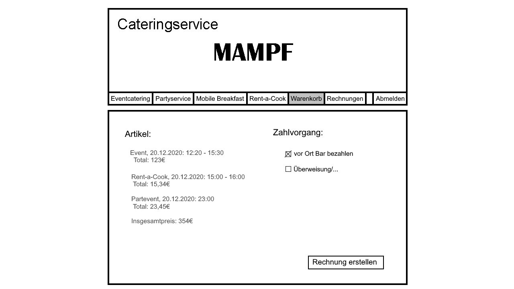

[[home_image]]

[[home_image]]

[[home_image]]

Admins Sicht
[[home_image]]
image::./images/gui_prototyp/welcome_boss.png[landing page, 100%, 100%, pdfwidth=100%, title= "Startseite für den Admin der Catering-Service", align=center]

[[home_image]]

[[home_image]]
image::./images/gui_prototyp/kunden_bearbeiten.png[kunden2, 100%, 100%, pdfwidth=100%, title= "Kunden-Seite: Wenn man auf 'Kunden bearbeiten' drückt, kann der Admin Kunde löschen", align=center]

[[home_image]]
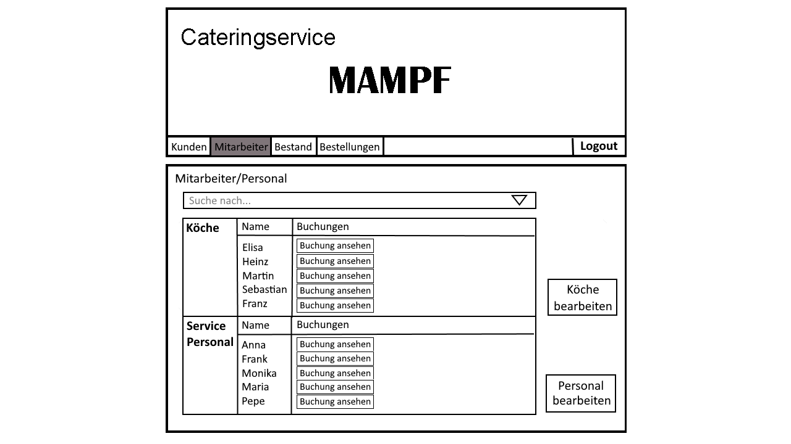

[[home_image]]

[[home_image]]

[[home_image]]

[[home_image]]
image::./images/gui_prototyp/mitarbeiter_buchung1.png[mitarbeiter4, 100%, 100%, pdfwidth=100%, title= "Mitarbeiter-Seite: Beispiel von der Übersicht einer Köchin-Buchung", align=center]

[[home_image]]
image::./images/gui_prototyp/mitarbeiter_buchung2.png[mitarbeiter5, 100%, 100%, pdfwidth=100%, title= "Mitarbeiter-Seite: Beispiel von der Übersicht einer Personal-Buchung", align=center]

[[home_image]]

[[home_image]]

[[home_image]]

[[home_image]]

[[home_image]]

[[home_image]]

[[home_image]]

[[home_image]]

[[home_image]]

[[home_image]]
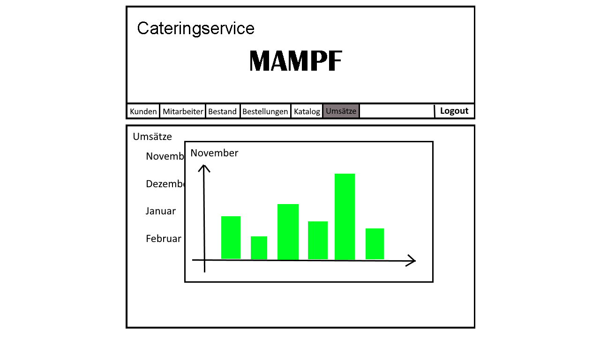

=== Überblick: Dialoglandkarte
[[home_image]]
image::./images/diagrams/gui_map.svg[guimap, 100%, 100%, pdfwidth=100%, title= "GUI Map", align=center]

=== Dialogbeschreibung
//Für jeden Dialog:

//1. Kurze textuelle Dialogbeschreibung eingefügt: Was soll der jeweilige Dialog? Was kann man damit tun? Überblick?
//2. Maskenentwürfe (Screenshot, Mockup)
//3. Maskenelemente (Ein/Ausgabefelder, Aktionen wie Buttons, Listen, …)
//4. Evtl. Maskendetails, spezielle Widgets

== Datenmodell

=== Überblick: Klassendiagramm
UML-Analyseklassendiagramm:
[[home_image]]
image::./images/diagrams/ClassDiagram.svg[bestellungen5, 100%, 100%, pdfwidth=100%, align=center]

=== Klassen und Enumerationen
Dieser Abschnitt stellt eine Vereinigung von Glossar und der Beschreibung von Klassen/Enumerationen dar. Jede Klasse und Enumeration wird in Form eines Glossars textuell beschrieben. Zusätzlich werden eventuellen Konsistenz- und Formatierungsregeln aufgeführt.

// See http://asciidoctor.org/docs/user-manual/#tables
[options="header"]
[cols="1,2"]
[[class_enumarations]]
|===
|Klasse/Enumeration |Beschreibung

| [[cart]] *Cart* (Warenkorb)
a| Der Warenkorb speichert temporär, welche <<item,Angebote>> ein Benutzer eventuell kaufen möchte. +
Wenn der benutzer die Angebote kauft, wird eine <<order,Bestellung ( Order )>> erstellt.

| *CartItem*
a| Ein Element im Warenkorb nennt sich CartItem und repräsentiert ein Angebot mit einer Quantität.

| [[catalog]] *Catalog* (Katalog)
a| Der Katalog speichert alle Angebote. Er ermöglicht das Erstellen neuer Angebote und das Filtern nach <<offerCategory, Kategorien>>.

| [[employee]] *Employee* (Personal)
a| Ein employee repräsentiert das Personal. Es gibt zwei grundlegende Personaltypen:

* Köche +
* Servicepersonal

|[[EmployeeType]] *EmployeeType* (Art des Angestellten)
| Es gibt Köche (COOK) und Servicepersonal (SERVICEPERSONAL)

| *EmployeeManager*
a| Diese Klasse enthält alles Personal, welches momentan bei der Catering-Firma angestellt ist.
Sie ermöglicht außerdem das Anstellen von neuen Mitarbeitern.

| *MampfApp*
a| Das ist die zentrale Klasse, die das Programm für die Organisation der Mampf-Firma enthält.

| [[inventory]] *Inventory*
a| Das Inventar listet, welche <<offerCategory,Ausrüstung>> in welcher Stückzahl verfügbar sind.

| [[item]] *Item* (Angebot)
a| Ein Angebot stellt eine Dienstleistung oder ein Produkt dar, welches der Benutzer kaufen bzw. mieten kann. +
Angebote werden unterteilt in Personal, Dekoration und Essen. +
Dabei erfolgt zusätzlich eine <<offerCategory,Kategorisierung>>.

| [[inventoryItem]] *InventoryItem* (Gegenstand im Inventar)

| Ein Gegenstand im Inventar wird mit einer Quantität beschrieben.
Diese kann verringert werden. Es kann weiterhin überprüft werden,
ob es genügent von diesem Gegenstand gibt, sowie die reine Anzahl.

| [[itemType]] Typ des Items:
*EquipmentItem*
*DecorationItem*
*EmployeeItem*
*FoodItem*

a| Es gibt verschiedene Grundtypen von Angeboten:

* Ausrüstung / Dekoration (z.B. Tischdecken) +
* Personal +
* Speisen (z.B. Buffet, Dinner, Käseplatten)

| [[offer]] *Offer* (Angebot)

| Die einzelnen Angebote sind einer
Angebotskategorie zuzuordnen und können
vom Katalog zu den Angeboten hinzugefügt werden

| [[offerCategory]] *OfferCategory* (Kategorie des Angebots)
a| Alle Angebote werden in eine Kategorie eingeteilt:

* Eventcatering +
* Partyservice +
* Mobile breakfast +
* Rent a cook +

| [[order]] *Order* (Bestellung)
a| Eine Bestellung repräsentiert, welche <<item, Angebote>> ein Benutzer mit welchem Datum und welcher
Adresse kaufen möchte. +
Außerdem wird bei einer Bestellung die Zahlungsmethode festgelegt.

Eine Bestellung durchläuft während ihrer Bearbeitung mehrere <<orderState,Status>>.

| [[orderLine]] *OrderLine*
| Eine OrderLine repräsentiert, welche Angebote in welcher Anzahl ein Benutzer bestellt hat.

| [[orderManager]] *OrderManager*
| Der Bestellungsmanager kennt alle bisher im Programm getätigten Bestellungen.

| [[orderState]] *OrderStatus* (Bestellstatus)
| Der Status repräsentiert den momentanen Bestellstatus. +
*OPEN*: Die Bestellung wurde erstellt, aber noch nicht bezahlt. +
*PAID*: Die Bestellung wurde bezahlt, aber sie wurde noch nicht bearbeitet (z.B. Personal zugewiesen). +
*COMPLETED*: Der Bestellung wurde Personal zugewiesen und sie wurde bearbeitet.
*CANCELLED*: Die Bestellung konnte nicht abgeschlossen werden, weil z.B. kein Personal zur Verfügung stand.

| [[customer]] *User* (Benutzer)
a| Ein Benutzer enthält alle Informationen eines realen, registrierten Benutzers im System.
Es gibt zwei Typen von Benutzern:

* Administratoren (admin)  - "ADMIN" +
* Kunden / "normalen Benutzer" - "CUSTOMER"

| *UserManager*
a| Diese Klasse enthält alle im Programm registrierten Benutzer und kann diese auflisten oder neue Benutzer hinzufügen.

|===

== Akzeptanztestfälle
Mithilfe von Akzeptanztests wird geprüft,
ob die Software die funktionalen Erwartungen und Anforderungen im Gebrauch erfüllt.

:Pre: Voraussetzung(en)
:Event: Event
:Result: Voraussichtliche Ergebnis

[cols="1h, 4"]
|===
|ID            |[[AT0010]]<<AT0010>>
|Use Case      |<<UC0010>>
|{Pre}        a|Das System besitzt eine Anzahl registrierter Nutzer.
|{Event}      a|Eine registrierter Benutzer ruft die Login-Seite ab, trägt Name und Passwort eines vorhandenen Users (daniel.88, food) ein und drückt auf „Login“.
|{Result}     a|
- Der User "daniel.88" ist angemeldet.
- Der User wird umgeleitet zur Startseite, welche eine „Willkommen“-Nachricht anzeigt.
- Der User hat jetzt Zugang zu allen Funktionalitäten, welche dem User mit der Rolle „Kunde“ zugänglich sind.
|===

[cols="1h, 4"]
|===
|ID            |[[AT0011]]<<AT0011>>
|Use Case      |<<UC0010>>
|{Pre}        a|Ein angemeldeter User benutzt das System.
|{Event}      a|Der angemeldete User drückt auf „Logout“ in der Navigationsleiste.
|{Result}     a|
- Der User wird abgemeldet.
-	Der User verliert Zugang zu Funktionalitäten, die nur User mit der Rolle „Kunde“ zugänglich sind.
|===

[cols="1h, 4"]
|===
|ID            |[[AT0020]]<<AT0020>>
|Use Case      |<<UC0020>>
|{Pre}        a|Ein nicht angemeldeter User benutzt das System.
|{Event}      a|
Der nicht angemeldete User drückt auf „Registrieren“ in der Navigationleiste und bekommt die Möglichkeit einen Namen und Passwort zu vergeben. 
Danach drückt er den Button "Registrieren".  
|{Result}     a|
-	Ein neuer Kunde wird erstellt mit den bereitgestellten Daten.
-	Es ist möglich, sich mit den Anmeldeinformationen des erstellten Kunden zu authentifizieren.
-	Unregistrierte Nutzer werden zur Startseite des Caterings umgeleitet.
|===

[cols="1h, 4"]
|===
|ID            |[[AT0021]]<<AT0021>>
|Use Case      |<<UC0020>>
|{Pre}        a|Ein nicht angemeldeter User benutzt das System.
|{Event}      a|Der nicht angemeldete User drückt auf „Registrieren“ in der Navigationleiste und bekommt die Möglichkeit einen Namen und Passwort zu vergeben. 
Danach drückt er den Button "Registrieren".  
|{Result}     a|
-	Eine Fehler-Nachricht wird angezeigt, um den User über das Problem zu informieren (bspw. der User existiert schon).
|===

[cols="1h, 4"]
|===
|ID            |[[AT0100]]<<AT0100>>
|Use Case      |<<UC0100>>, <<UC0110>>
|{Pre}        a|Ein User benutzt das System.
|{Event}      a|Der User drückt auf „Eventcatering“ in der Navigationsleiste.
|{Result}     a|
-	Der User bekommt eine Übersicht von den verschiedenen Typen von Buffet (3), Dinner (3), Ausstattung (2), Termin, Personal (Köche und Service) und Zwischensumme gezeigt.
-	Wenn der User angemeldet ist, kann er eine Bestellung aufgeben (Anzahl des gewählten Typs, Termin und Adresse hinzufügen).
-	Wenn es nicht genügend Personal für den Termin gibt, muss eine Fehler-Nachricht angezeigt werden.
|===

[cols="1h, 4"]
|===
|ID            |[[AT0101]]<<AT0101>>
|Use Case      |<<UC0100>>, <<UC0110>>
|{Pre}        a|Ein User benutzt das System.
|{Event}      a|Der User drückt auf „Partyservice“ in der Navigationsleiste.
|{Result}     a|
-	Der User wird eine Übersicht von den verschiedenen Typen von Angeboten (2), Sonderangebote (1), Termin und Zwischensumme.
-	Wenn der User angemeldet ist, kann er eine Bestellung aufgeben (Anzahl des gewählten Typs, Termin und Adresse hinzufügen).
|===

[cols="1h, 4"]
|===
|ID            |[[AT0102]]<<AT0102>>
|Use Case      |<<UC0100>>, <<UC0110>>
|{Pre}        a|Ein User benutzt das System.
|{Event}      a|Der User drückt auf „Mobile Breakfast“ in der Navigationsleiste.
|{Result}     a|
-	Der User wird eine Übersicht von den verschiedenen Typen von täglichen Angeboten (1), Frühstückstermin und Zwischensumme.
-	Wenn der User angemeldet ist, kann er eine Bestellung aufgeben (Anzahl des gewählten Typs, Termin und Adresse hinzufügen).
|===

[cols="1h, 4"]
|===
|ID            |[[AT0103]]<<AT0103>>
|Use Case      |<<UC0100>>, <<UC0110>>
|{Pre}        a|Ein User benutzt das System.
|{Event}      a|Der User drückt auf „Rent-a-Cook“ in der Navigationsleiste.
|{Result}     a|
-	Der User wird eine Übersicht von Personal (Köche oder Service) zu buchen.
-	Wenn der User angemeldet ist, kann er eine Bestellung aufgeben (Anzahl des gewählten Typs, Termin und Adresse hinzufügen).
-	Wenn es nicht genügend Personal für den Termin gibt, muss eine Fehler-Nachricht gezeigt werden.
|===

[cols="1h, 4"]
|===
|ID            |[[AT0104]]<<AT0104>>
|Use Case      |<<UC0101>>
|{Pre}        a|
-	Der User hat der Rolle Administrator.
-	Der User befindet sich in Katalog.
|{Event}      a|
-	Der User drückt auf Katalog bearbeiten.
-	Der User drückt auf „Katalogeinträge erstellen“.
|{Result}     a|
-	Der User kann neue Katalogeinträge erstellen zu einer der drei Kategorien: Eventcatering, Partyservice und Mobile-Breakfast, und ihre Subkategorien.
|===

[cols="1h, 4"]
|===
|ID            |[[AT0105]]<<AT0105>>
|Use Case      |<<UC0101>>
|{Pre}        a|
-	Der User hat der Rolle Administrator.
-	Der User befindet sich in Katalog.
|{Event}      a|
-	Der User drückt auf Katalog bearbeiten.
-	Der User wählt ein Element aus.
- Der User drückt auf „Elemente ändern“.
|{Result}     a|
-	Der User kann dieses ausgewählte Element verändern.
|===

[cols="1h, 4"]
|===
|ID            |[[AT0106]]<<AT0106>>
|Use Case      |<<UC0101>>
|{Pre}        a|
-	Der User hat der Rolle Administrator.
-	Der User befindet sich in Katalog.
|{Event}      a|
-	Der User drückt auf Katalog bearbeiten.
-	Der User wählt beliebige Elemente aus.
- Der User drückt auf „Elemente löschen“.
|{Result}     a|
-	Der User kann diese ausgewählten Elemente verändern.
|===

[cols="1h, 4"]
|===
|ID            |[[AT0200]]<<AT0200>>
|Use Case      |<<UC0200>>
|{Pre}        a|
-	Der User ist ein angemeldeter User.
-	Der User befindet sich in einer der drei Kataloge: Eventcatering ([AT0100]), Partyservice ([AT0101]), Rent-a-Cook ([AT0103])
|{Event}      a|Der User drückt auf “Zum Warenkorb hinzufügen”.
|{Result}     a|
-	Der Bestellung/Order ist gespeichert und wird in dem Warenkorb gesetzt.
|===

[cols="1h, 4"]
|===
|ID            |[[AT0201]]<<AT0201>>
|Use Case      |<<UC0200>>
|{Pre}        a|
-	Der User ist ein angemeldeter User von einer Firma, d.h. der User hat der Rolle „Company“ oder „Employee“.
-	Der User befindet sich in Mobile Breakfast ([AT0102]).
|{Event}      a|Der User drückt auf “Zum Warenkorb hinzufügen”.
|{Result}     a|
-	Die Bestellung/Order ist gespeichert und wird in den Warenkorb gesetzt.
|===

[cols="1h, 4"]
|===
|ID            |[[AT0202]]<<AT0202>>
|Use Case      |<<UC0202>>
|{Pre}        a|Der User ist ein angemeldeter User.
|{Event}      a|Der User drückt auf “Warenkorb”.
|{Result}     a|
-	Es wird gezeigt, was der User schon zum Warenkorb hinzugefügt hat (Typ von Event, Datum, Gesamtpreis und Zahlvorgang).
|===

[cols="1h, 4"]
|===
|ID            |[[AT0210]]<<AT0210>>
|Use Case      |<<UC0210>>
|{Pre}        a|
- Der User ist ein angemeldeter User.
- Es gibt Elemente in den Warenkorb.
|{Event}      a|Der User drückt auf “Warenkorb leeren”.
|{Result}     a|
-	Der Warenkorb hat jetzt keine Elemente.
|===

[cols="1h, 4"]
|===
|ID            |[[AT0220]]<<AT0220>>
|Use Case      |<<UC0220>>
|{Pre}        a|
- Der User ist ein angemeldeter User.
- Der User hat Elemente zu dem Warenkorb hinzugefügt.
|{Event}      a|
- Der User entscheidet sich für eine Zahlungsmethode: Bar oder Überweisung.
-	Wenn es eine Überweisung ist, wird dem User eine Bankverbindung angegeben und er wird aufgefordert die Zahlung bis zu einem bestimmten Datum zu tätigen.
-	Der User drückt auf „Rechnung erstellen“.
|{Result}     a|
-	Eine Rechnung muss erstellt werden mit Angabe einer Bankverbindung.
|===

[cols="1h, 4"]
|===
|ID            |[[AT0243]]<<AT0243>>
|Use Case      |<<UC0243>>
|{Pre}        a|
- Der User ist ein angemeldeter User.
- Der User hat eine Bestellung aufgegeben.
|{Event}      a|Der User drückt auf „Meine Bestellungen“ in der Navigationsleiste.
|{Result}     a|
-	Es werden alle Bestellungen des Users gezeigt (bestellte Produkte, Datum und Status der Lieferung).
|===

[cols="1h, 4"]
|===
|ID            |[[AT0400]]<<AT0400>>
|Use Case      |<<UC0400>>
|{Pre}        a|
- Der User ist ein angemeldeter User.
- Der User hat eine Bestellung aufgegeben.
- Der User befindet sich in "Meine Bestellungen".
|{Event}      a|Der User klickt auf eine bestimmte Bestellung.
|{Result}     a|
-	Die Rechnung für diese Bestellung wird angezeigt.
|===

[cols="1h, 4"]
|===
|ID            |[[AT0300]]<<AT0300>>
|Use Case      |<<UC0300>>
|{Pre}        a|
- Der User hat der Rolle Administrator.
- Der User befindet sich in der Kunde-Seite.
|{Event}      a|Der User drückt auf „Kunde bearbeiten“, wählt sich ein Kunde aus und drückt auf „Kunde löschen“.
|{Result}     a|
-	Der Kunde wird gelöscht.
|===

[cols="1h, 4"]
|===
|ID            |[[AT0301]]<<AT0301>>
|Use Case      |<<UC0301>>
|{Pre}        a|Der User hat der Rolle Administrator.
|{Event}      a|Der User drückt auf „Kunde“ in dem Menü.
|{Result}     a|
-	Eine Liste aller Kunden wird angezeigt.
|===

[cols="1h, 4"]
|===
|ID            |[[AT0310]]<<AT0310>>
|Use Case      |<<UC0310>>
|{Pre}        a|Der User besitzt die Rolle Administrator.
|{Event}      a|Der User drückt auf „Bestellungen“ in der Navigationsleiste.
|{Result}     a|
-	Es werden alle Bestellungen angezeigt.
|===

[cols="1h, 4"]
|===
|ID            |[[AT0320]]<<AT0320>>
|Use Case      |<<UC0320>>
|{Pre}        a|Der User besitzt die Rolle Administrator.
|{Event}      a|Der User drückt auf „Bestand“ in der Navigationsleiste.
|{Result}     a|
-	Es wird der Bestand/das Inventar (Tischdecken und Dekoration) angezeigt.
- Die aktuelle Anzahl und die Gesamtanzahl des Bestands wird angezeigt.
|===

[cols="1h, 4"]
|===
|ID            |[[AT0330]]<<AT0330>>
|Use Case      |<<UC0330>>
|{Pre}        a|Der User besitzt die Rolle Administrator.
|{Event}      a|Der User drückt auf „Personal“ in der Navigationsleiste.
|{Result}     a|
-	Es wird das Personal (Köche und Service-Personal) angezeigt. Es zeigt auch, ob und welches Personal gebucht ist oder nicht und an welchem Datum.
|===

[cols="1h, 4"]
|===
|ID            |[[AT0331]]<<AT0331>>
|Use Case      |<<UC0331>>
|{Pre}        a|
- Der User besitzt die Rolle Administrator.
- Der User befindet sich auf der Seite „Bestellungen“.
- Es gibt Bestellungen, die die Zuweisung von Personal benötigen.
|{Event}      a|Der User drückt auf „Personal/Köche“ in der Navigationsleiste.
|{Result}     a|
- Es wird eine Liste offener Bestellungen angezeigt
- Der Administrator kann durch einen klick auf Personal zuweisen, durch eine Dialogbox bestimmtes Personal der jeweiligen Bestellung hinzufügen.
- Gebuchtes Personal steht nicht zu Auswahl.
|===

[cols="1h, 4"]
|===
|ID            |[[AT0341]]<<AT0341>>
|Use Case      |<<UC0341>>
|{Pre}        a|
- Der User hat der Rolle Administrator.
- Der User befindet sich in der „Mitarbeiter“ Seite.
|{Event}      a|Der User drückt auf die Textfläche und dann drückt auf Köche/Personal.
|{Result}     a|
-	Es wird die Mitarbeiter ausgefiltert.
- Es werden nur Köche oder nur Service Personal angezeigt.
|===

[cols="1h, 4"]
|===
|ID            |[[AT0342]]<<AT0342>>
|Use Case      |<<UC0342>>
|{Pre}        a|
- Der User hat der Rolle Administrator.
- Der User befindet sich in der „Mitarbeiter“ Seite.
|{Event}      a|
- Der User drückt auf „Köche/Personal bearbeiten“.
- Der User drückt auf „Köche/Personal hinzufügen“.
|{Result}     a|
-	Der User schreibt ein neuer Koch/Personal.
- Diese wird hinzugefügt.
|===

[cols="1h, 4"]
|===
|ID            |[[AT0344]]<<AT0344>>
|Use Case      |<<UC0344>>
|{Pre}        a|
- Der User hat der Rolle Administrator.
- Der User befindet sich in der „Mitarbeiter“ Seite.
|{Event}      a|
- Der User drückt auf „Köche/Personal bearbeiten“.
- Der User drückt auf „Köche/Personal ändern“.
|{Result}     a|
-	Der Koch/Personal wird verändert.
|===

[cols="1h, 4"]
|===
|ID            |[[AT0345]]<<AT0345>>
|Use Case      |<<UC0344>>
|{Pre}        a|
- Der User hat der Rolle Administrator.
- Der User befindet sich in der „Mitarbeiter“ Seite.
|{Event}      a|
- Der User drückt auf „Köche/Personal bearbeiten“.
- Der User drückt auf „Köche/Personal löschen“.
|{Result}     a|
-	Der Koch/Personal wird gelöscht.
|===

[cols="1h, 4"]
|===
|ID            |[[AT0420]]<<AT0420>>
|Use Case      |<<UC0420>>
|{Pre}        a|
- Der User hat der Rolle Administrator.
- Der User befindet sich in der „Umsätze“ Seite.
|{Event}      a|
- Der User drückt einen bestimmten Monat.
|{Result}     a|
-	Es werden alle Umsätze des jeweiligen Monats angezeigt.
|===

== Glossar
Sämtliche Begriffe, die innerhalb des Projektes verwendet werden und deren gemeinsames Verständnis aller beteiligten Stakeholder essentiell ist, werden hier aufgeführt.

:domain_ref: Siehe <<102-klassen-und-enumerationen, Klassen und Enumerationen>>

[options="header", cols="1h, 4"]
[[glossar]]
|===
|Begriff                |Beschreibung
|Administrator          | Synonym für den Chef und Personal welches berechtigt ist Daten zu verwalten
|Angebot                | Angebote sind z.B. verschieden Platten, Buffets, Mieten von Ausrüstung / Dekoration und das Mieten von Personal
|Akteure                | Akteure sind die Benutzer des Software-Systems oder Nachbarsysteme, welche darauf zugreifen.
|Item                   | {domain_ref}
|Cart                   | {domain_ref}
|CartItem               | {domain_ref}
|Category               | Bezeichnet die Domäne in der das jeweilige Item angesiedelt ist (bspw. PartyService)
|ChargeLine             | {domain_ref}
|Employee               | {domain_ref}
|EmployeeManager        | {domain_ref}
|GUI                    | Beschreibt das Interface mit dem der Nutzer interagiert
|Inventory              | {domain_ref}
|InventoryItem          | {domain_ref}
|Login                  | Erfolgreiche Authentifizierung nach Eingabe der notwenidigen Credentials
|Order                  | {domain_ref}
|OrderLine              | {domain_ref}
|OrderManager           | {domain_ref}
|OrderStatus            | {domain_ref}
|Item                   | {domain_ref}
|Register/Registration  | Bezeichnet den Vorgang zum anlegen eines neuen Benutzer-Accounts
|ROLE/Role              | {domain_ref}
|System                 | Synonym für die Software um die es in diesem Projekt geht
|User                   | {domain_ref}
|===
